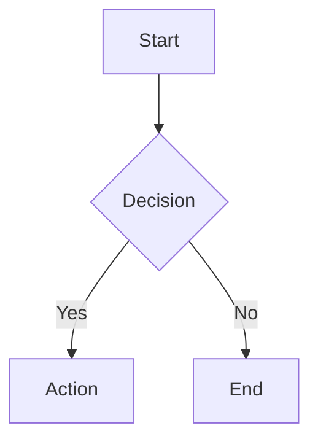

# Insert Diagram

Insert a Mermaid diagram into a Notesage markdown document. The editor renders Mermaid code blocks as interactive SVG diagrams inline.

## How It Works

Notesage natively renders fenced mermaid code blocks. Just write a standard markdown code block with the `mermaid` language tag:

````markdown

````

The editor automatically renders this as a visual SVG diagram. Users can double-click to edit the source. The mermaid source lives directly in the document — no sidecar files needed.

## Workflow

1. **Read the current document** to find where the diagram should be inserted.

2. **Write the updated document** with a fenced mermaid code block at the desired location:
   ````markdown
   ```mermaid
   flowchart TD
       A[Start] --> B[Process] --> C[End]
   ```
   ````
   The code block should be on its own paragraph (blank lines above and below). See `references/MERMAID-SYNTAX.md` for the syntax reference and `references/EXAMPLES.md` for complete working examples.

3. **Done.** The editor detects the file change and renders the diagram as an interactive SVG.

### Alternative: SVG file approach

For diagrams that need to be shared as standalone image files, you can render to SVG instead:

1. Write the Mermaid source to `<project_root>/.notesage/diagrams/{id}.mmd`
2. Render to SVG by calling `execute_skill_script("insert-diagram", "scripts/render-mermaid.mjs", ["<input.mmd>", "<output.svg>"])`
3. Insert `` into the document

This approach requires the Mermaid CLI dependency but produces a standalone SVG file usable outside Notesage.

## Supported Diagram Types

| Type | Mermaid Keyword | Best For |
|------|-----------------|----------|
| Flowchart | `graph TD` / `graph LR` | Process flows, decision trees |
| Sequence diagram | `sequenceDiagram` | API interactions, message flows |
| Class diagram | `classDiagram` | Object models, type hierarchies |
| State diagram | `stateDiagram-v2` | State machines, lifecycles |
| Gantt chart | `gantt` | Project timelines, schedules |
| Pie chart | `pie` | Proportional data (simple) |
| ER diagram | `erDiagram` | Database schemas, entity relationships |
| Mindmap | `mindmap` | Brainstorming, topic hierarchies |

## Tips

- **Mermaid is the alternative to Excalidraw** — use it only when the user explicitly requests Mermaid syntax, or for complex structured diagrams where Mermaid excels (sequence diagrams with many participants, detailed class hierarchies, Gantt charts). For most diagrams (flowcharts, architecture, process flows), prefer `insert-drawing` (Excalidraw) — drawings are interactive and the user can edit them visually.
- **Start with a simple diagram** and verify it renders before adding complexity. Mermaid syntax errors produce no output, so incremental building catches issues early.
- **Use `graph LR`** (left-to-right) for wide diagrams like pipelines. Use **`graph TD`** (top-down) for tall diagrams like decision trees.
- **Keep labels concise.** Long node labels make diagrams hard to read. Use short names in nodes and add a legend or description in the surrounding text.
- **Subgraphs** help organize complex flowcharts. Group related nodes into named subgraphs for clarity.
- If you need to edit an existing diagram, read the `.mmd` source file, modify it, re-render the SVG, and the editor will pick up the change.

## Troubleshooting

- **SVG not generated:** Check that the Mermaid source is valid syntax. Common errors: missing arrow syntax (`-->` not `-->`), unquoted labels with special characters, typos in diagram type keywords.
- **Render script fails with "mmdc not found":** The Mermaid CLI needs to be installed. The script attempts `npx @mermaid-js/mermaid-cli` as a fallback, which requires Node.js and npm to be available.
- **Diagram too small or too large:** Mermaid auto-sizes based on content. For very large diagrams, consider splitting into multiple smaller diagrams with cross-references.
- **Special characters in labels:** Wrap labels in double quotes if they contain parentheses, brackets, or other special characters: `A["Label (with parens)"]`.

## References

- `references/MERMAID-SYNTAX.md` — Mermaid syntax reference for all supported diagram types
- `references/EXAMPLES.md` — Complete working examples for each diagram type
