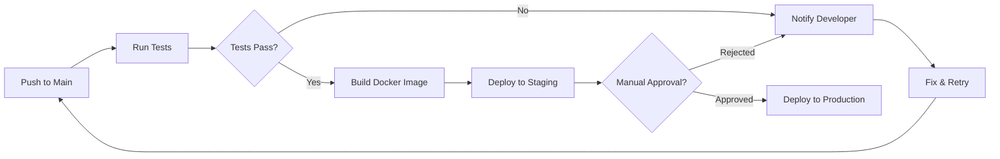
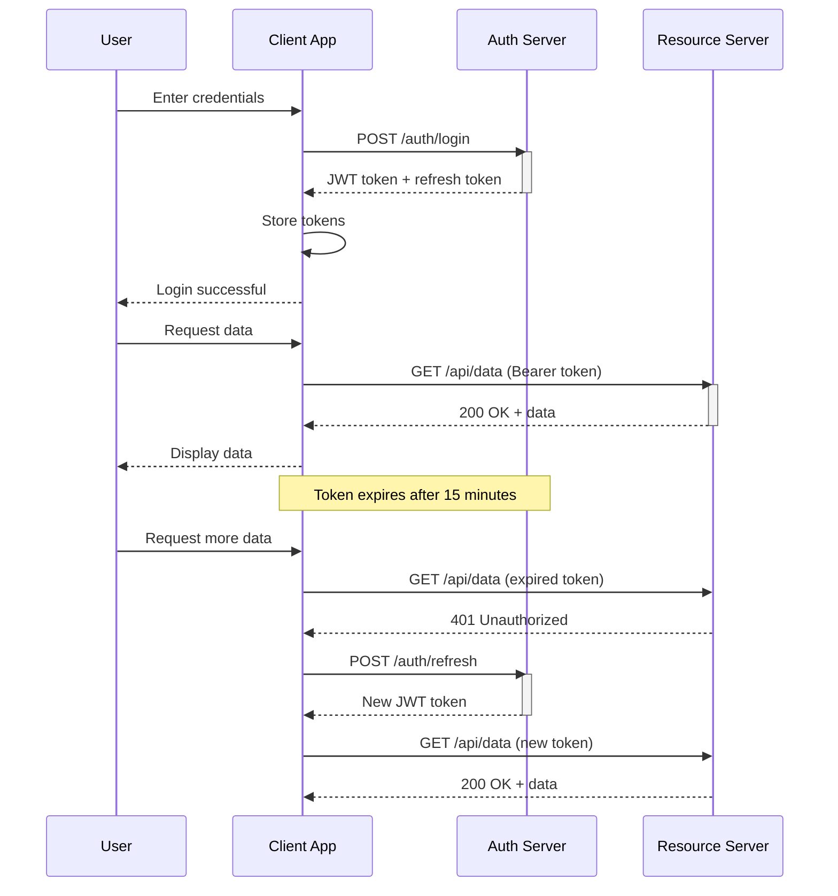
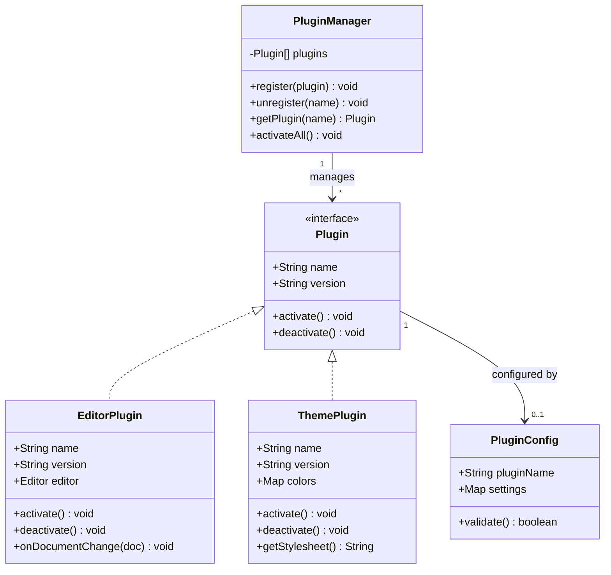
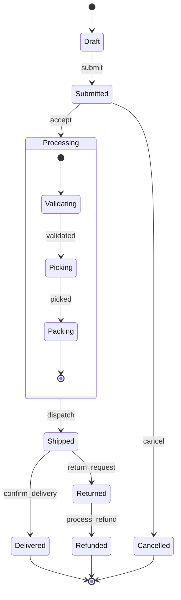
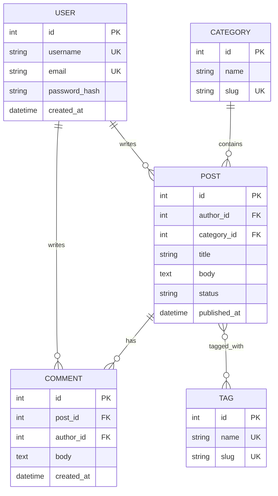
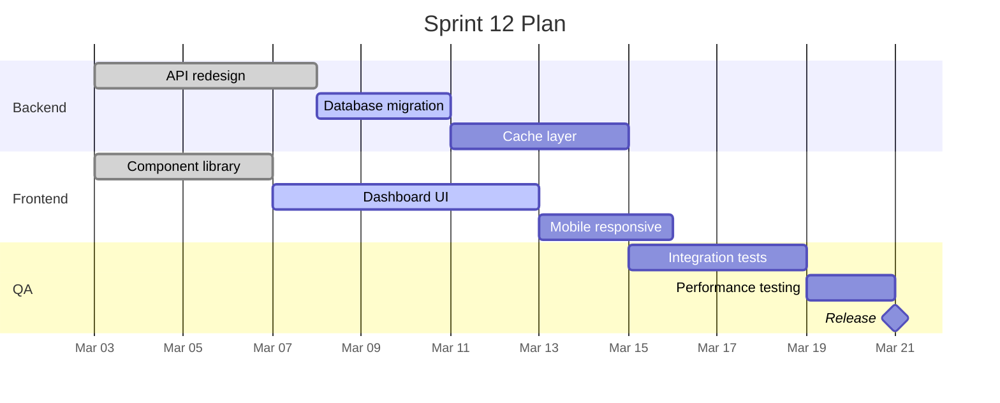

# Diagram Examples

Complete Mermaid source examples ready to use. Each example includes the `.mmd` file content and the markdown line to insert (after rendering to SVG).

---

## Example 1: Flowchart — CI/CD Pipeline

**Mermaid source** (`.notesage/diagrams/cicd-example.mmd`):


**Markdown to insert (after rendering):**
```markdown

```

---

## Example 2: Sequence Diagram — Authentication Flow

**Mermaid source** (`.notesage/diagrams/auth-flow-example.mmd`):


**Markdown to insert (after rendering):**
```markdown

```

---

## Example 3: Class Diagram — Plugin System

**Mermaid source** (`.notesage/diagrams/plugin-system-example.mmd`):


**Markdown to insert (after rendering):**
```markdown

```

---

## Example 4: State Diagram — Order Lifecycle

**Mermaid source** (`.notesage/diagrams/order-lifecycle-example.mmd`):


**Markdown to insert (after rendering):**
```markdown

```

---

## Example 5: ER Diagram — Blog Schema

**Mermaid source** (`.notesage/diagrams/blog-schema-example.mmd`):


**Markdown to insert (after rendering):**
```markdown

```

---

## Example 6: Gantt Chart — Sprint Plan

**Mermaid source** (`.notesage/diagrams/sprint-plan-example.mmd`):


**Markdown to insert (after rendering):**
```markdown

```
