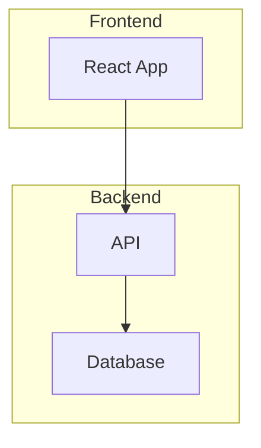
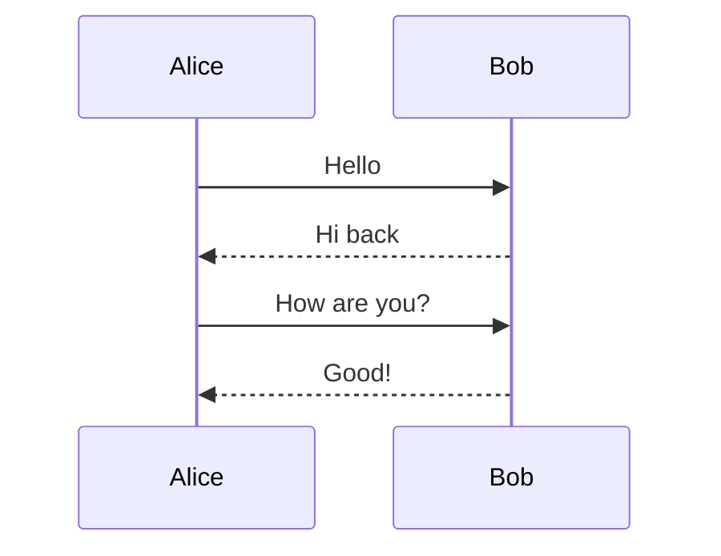
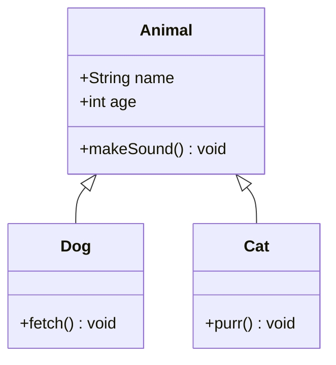
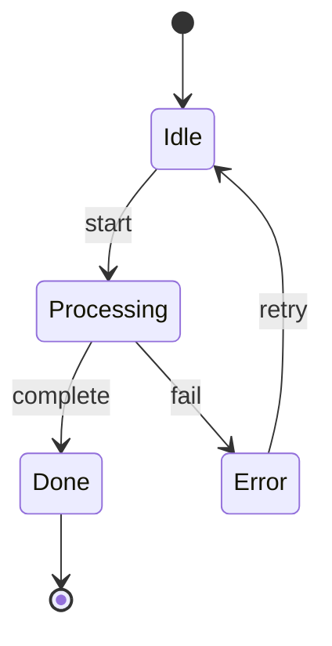
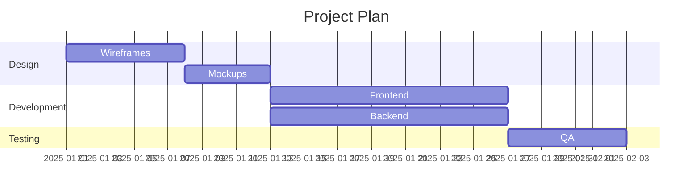
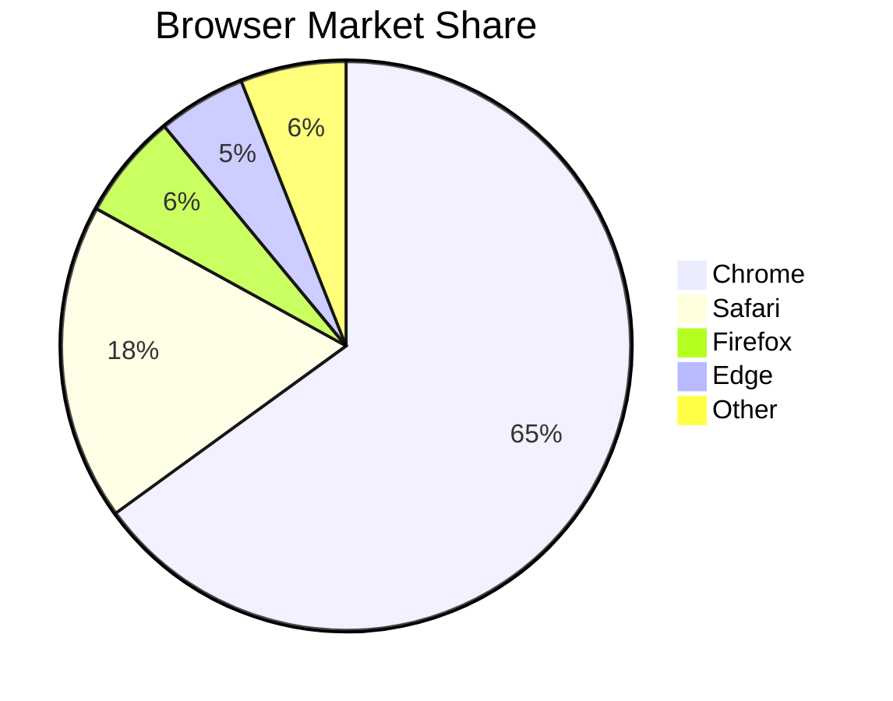
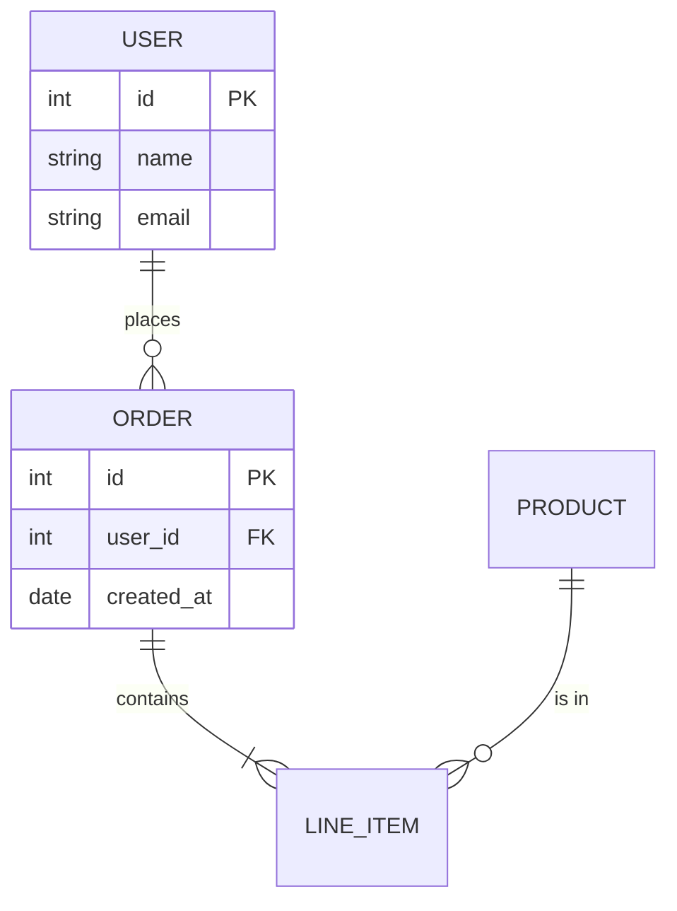
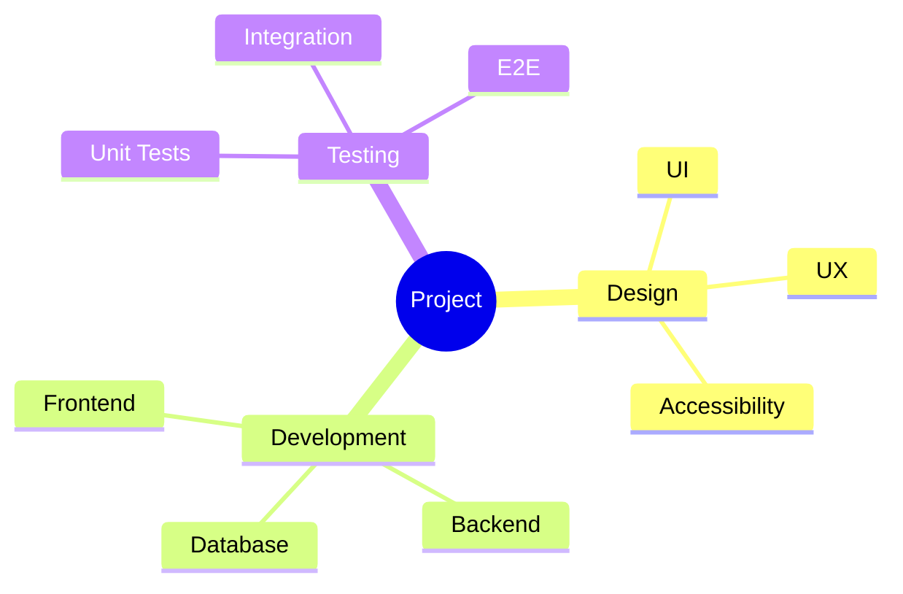

# Mermaid Syntax Reference

Mermaid is a text-based diagramming language. Each diagram starts with a keyword declaring the diagram type, followed by the diagram definition.

## Flowchart

Defines process flows with nodes and directional links.

**Direction keywords:**
- `graph TD` or `graph TB` — top to bottom (vertical)
- `graph LR` — left to right (horizontal)
- `graph BT` — bottom to top
- `graph RL` — right to left

**Node shapes:**

| Syntax | Shape |
|--------|-------|
| `A[Text]` | Rectangle |
| `A(Text)` | Rounded rectangle |
| `A([Text])` | Stadium/pill shape |
| `A{Text}` | Diamond/rhombus |
| `A{{Text}}` | Hexagon |
| `A[[Text]]` | Subroutine |
| `A[(Text)]` | Cylinder (database) |
| `A((Text))` | Circle |
| `A>Text]` | Asymmetric (flag) |

**Link types:**

| Syntax | Description |
|--------|-------------|
| `A --> B` | Arrow |
| `A --- B` | Line (no arrow) |
| `A -.- B` | Dotted line |
| `A -.-> B` | Dotted arrow |
| `A ==> B` | Thick arrow |
| `A -- text --> B` | Arrow with label |
| `A -. text .-> B` | Dotted arrow with label |

**Subgraphs:**



## Sequence Diagram

Models interactions between participants over time.

**Keywords:**



**Message types:**

| Syntax | Description |
|--------|-------------|
| `A->>B: msg` | Solid arrow (synchronous) |
| `A-->>B: msg` | Dashed arrow (async response) |
| `A-xB: msg` | Solid cross (lost message) |
| `A-)B: msg` | Open arrow |

**Blocks:**

```
alt Condition
    A->>B: Message
else Other condition
    A->>B: Other message
end

loop Every minute
    A->>B: Heartbeat
end

opt Optional
    A->>B: Maybe
end

par Parallel
    A->>B: Task 1
and
    A->>C: Task 2
end
```

**Notes:**

```
Note right of A: This is a note
Note over A,B: Spanning note
```

**Activation:**

```
activate A
A->>B: Request
activate B
B-->>A: Response
deactivate B
deactivate A
```

## Class Diagram

Models object-oriented class structures and relationships.



**Relationships:**

| Syntax | Description |
|--------|-------------|
| `A <\|-- B` | Inheritance (B extends A) |
| `A *-- B` | Composition |
| `A o-- B` | Aggregation |
| `A --> B` | Association |
| `A ..> B` | Dependency |
| `A <\|.. B` | Realization |

**Cardinality:**

```
A "1" --> "*" B : contains
A "1" --> "0..1" B : optional
```

**Visibility modifiers:**

| Prefix | Visibility |
|--------|------------|
| `+` | Public |
| `-` | Private |
| `#` | Protected |
| `~` | Package |

## State Diagram

Models state machines with transitions.



**Special states:**

| Syntax | Description |
|--------|-------------|
| `[*]` | Start/end state |
| `state "Long name" as s1` | State alias |

**Composite states:**

```
state Active {
    [*] --> Running
    Running --> Paused : pause
    Paused --> Running : resume
}
```

**Choice (branching):**

```
state check <<choice>>
Processing --> check
check --> Success : valid
check --> Failure : invalid
```

**Fork/join (parallel):**

```
state fork_state <<fork>>
state join_state <<join>>
Idle --> fork_state
fork_state --> Task1
fork_state --> Task2
Task1 --> join_state
Task2 --> join_state
join_state --> Done
```

## Gantt Chart

Project timeline visualization.



**Task status modifiers:**

| Modifier | Description |
|----------|-------------|
| `done` | Completed task |
| `active` | Current task |
| `crit` | Critical path |
| `milestone` | Milestone marker |

```
section Phase 1
    Task A :done, a1, 2025-01-01, 5d
    Task B :active, b1, after a1, 3d
    Release :milestone, m1, after b1, 0d
```

## Pie Chart

Simple proportional data display.



Values are automatically converted to percentages. The title is optional.

## ER Diagram

Entity-relationship diagrams for database schemas.



**Relationship cardinality:**

| Left | Right | Meaning |
|------|-------|---------|
| `\|\|` | `\|\|` | Exactly one |
| `\|\|` | `o{` | Zero or more |
| `\|\|` | `\|{` | One or more |
| `o\|` | `o{` | Zero or one to zero or more |

## Mindmap

Hierarchical topic maps using indentation.



Node shapes in mindmaps:
- `root((text))` — circle (root)
- `text` — default rectangle
- `(text)` — rounded
- `[text]` — square
- `))text((` — bang (explosion)
- `)text(` — cloud

## General Tips

- **Wrap labels with special characters in quotes:** `A["Label (with parens)"]`
- **Use `%%` for comments:** `%% This is a comment`
- **Keep node IDs short:** Use `A`, `B`, `C` or short meaningful names like `api`, `db`
- **Avoid spaces in IDs:** Use hyphens or camelCase: `my-node` or `myNode`
- **Test incrementally:** Start with a small diagram and add nodes one at a time
