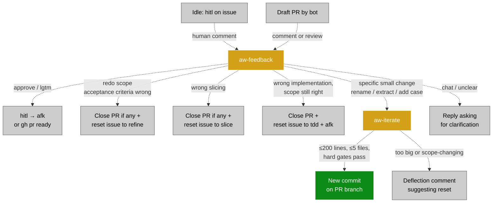

# Agentic Workflow (AW)

The AW pipeline turns a fresh GitHub issue into a reviewed pull request, autonomously, with TDD discipline and human review gates. Eight Claude Code skills, ten GitHub Actions workflows, coordinated through a label state machine. Human feedback is a first-class loop — comments on hitl-labeled issues or PRs route the agent back to any earlier stage as needed. Every bot-authored draft PR is independently reviewed by `aw-review` before being marked ready for human review.

This document captures the system as it stands today and the design choices that shaped it. Skill rules live in `.claude/skills/aw-<name>/SKILL.md` (the source of truth for agent behavior).

## Goals

- **Turn issues into PRs with discipline.** Every issue passes through triage → refine → slice → tdd. Each PR is implemented under red-green-refactor.
- **Human review at every shipping gate.** Draft PRs only, never auto-merge. Issues marked `hitl` wait for human approval before code is written. Skill patches go through draft PRs.
- **Self-improving.** On PR merge, `aw-retrospect` proposes skill patches based on what diverged. Skills get sharper over time.
- **Resilient.** Each stage is idempotent. State lives in labels — anyone can flip a label and the system recovers. Cron sweeps catch what events miss.
- **Cheap on tokens.** Bash prechecks short-circuit empty queues before invoking the LLM. The pipeline workflow runs stages back-to-back rather than separate event-triggered runs.

## Non-goals

- **Replacing human review.** Every PR opens as a draft. Every skill patch opens as a draft. Humans still merge.
- **Implementing arbitrary user requests at scale.** AW assumes one PR fits a shippable unit of user value. If too large, aw-slice splits it into peer issues — each must still ship something useful. Larger work needs human planning.
- **Cross-repo coordination.** One repo at a time today. Multi-repo features are open future work.

## Stack

| Layer | Technology | Where |
| --- | --- | --- |
| Runtime | GitHub Actions | `.github/workflows/aw-*.yml` |
| Agent | `anthropics/claude-code-action@v1` | invoked from each workflow step |
| Auth | OAuth via `CLAUDE_CODE_OAUTH_TOKEN` | uses Claude Code subscription quota |
| Skills | `.claude/skills/aw-<name>/SKILL.md` | one per pipeline stage |
| State | GitHub issue labels | label state machine |

The skill files double as the canonical contract — every workflow's prompt is just *"Run the* `aw-<name>` *skill at* `.claude/skills/aw-<name>/SKILL.md`*"* plus a few hard-constraint reminders. Substance lives in the SKILL.md files.

## Pipeline overview

```mermaid
flowchart TD
  A[Human creates issue] -->|issues.opened fires aw-pipeline.yml| B[aw-triage]
  B -.->|duplicate / wontfix / ambiguous| Z[Closed or needs-info]
  B -->|+ category, + refine| C[aw-refine]
  C -.->|still too vague| W[Comment + leave refine]
  C -->|+ refined, + slice<br/>- refine| D[aw-slice]
  D -.->|+ awaiting-research<br/>create 1 research peer issue| R[Research peer<br/>human flips original back<br/>to slice when done]
  D -.->|N independent values:<br/>rewrite original as slice 1,<br/>create N-1 peer issues| E[Peer issues<br/>each enters its own pipeline]
  D -->|1 user value default:<br/>+ tdd, + hitl-or-afk<br/>- slice| F[aw-tdd<br/>on the same issue]
  F -.->|hitl: wait for human flip| H[Idle: hitl]
  F -.->|hard gate fails| FAIL[Re-add afk + failure comment]
  F -->|red→green→refactor passes,<br/>+ review, draft PR opened| G[Draft PR<br/>body: Fixes/Resolves #N]
  G -->|pull_request.opened fires aw-review.yml| RV[aw-review]
  RV -.->|gaps found:<br/>close PR + reset to tdd + afk<br/>(max 2 retries, then escalate)| F
  RV -->|all criteria met| RDY[PR marked ready]
  RDY -->|human reviews + merges| M[Merged]
  M -->|GitHub auto-close<br/>via 'Fixes #N' or 'Resolves #N'| IC[Issue closed]
  M -->|pull_request.closed merged=true| N[aw-retrospect]
  N -.->|clean run, no signal| P[Comment: no patch needed]
  N -->|signal found| O[Draft retro PR<br/>proposing SKILL.md patch]

  classDef skill fill:#1d76db,stroke:#fff,color:#fff
  classDef terminal fill:#0e8a16,stroke:#fff,color:#fff
  classDef stop fill:#cccccc,stroke:#666,color:#000
  class B,C,D,F,N,RV skill
  class G,M,O,IC,RDY terminal
  class Z,W,H,FAIL,P,E stop
```

The two pause points in this diagram (`Idle: hitl` and `Draft PR`) are not dead ends. Human comments at either point fire `aw-feedback`, which routes the agent back to any earlier stage based on the comment's intent. Small in-place code tweaks on the PR are handled by `aw-iterate` instead of a full re-implementation. See the feedback-loop diagram below.

**How the issue closes.** Notesage doesn't have a "close-issue" step in the pipeline. `aw-tdd` writes a category-appropriate auto-close line into the PR body — `Fixes #N` for bugs, `Resolves #N` for enhancements and chores — and GitHub's built-in linked-issue mechanism auto-closes issue `#N` when the human merges the PR. The keyword matters: GitHub only auto-closes on `close|closes|closed`, `fix|fixes|fixed`, `resolve|resolves|resolved`. Earlier versions of `aw-tdd` wrote `Implements #N`, which is **not** a recognized keyword — those PRs merged cleanly but left the linked issue open and required manual cleanup. Other closure paths: `aw-triage` may close as `duplicate` or `wontfix` directly; research peers are closed by the human when findings are posted; peer issues from a multi-value split each enter their own pipeline and close the same way (PR merge → auto-close).

### Feedback loops (aw-feedback + aw-iterate)



`aw-feedback` is the only skill that NEVER generates code. It only changes labels and PR state. Code changes (even tiny ones) go through `aw-iterate`, which checks out the existing PR branch, applies the same hard gates as `aw-tdd` (red-green-refactor where new behavior is added, full test suite, typecheck, no unrelated files), and pushes one commit. If the requested change is too big for safe in-place iteration, `aw-iterate` deflects back to `aw-feedback`'s reset paths — a small wrong commit pollutes the PR; a deflection is recoverable.

## Label scheme

Labels are the state of the system.

**Action labels** (mutually exclusive — what's needed next):

| Label | Means | Set by | Removed by |
| --- | --- | --- | --- |
| `refine` | aw-refine should pick up | aw-triage | aw-refine |
| `slice` | aw-slice should pick up | aw-refine (or human after research) | aw-slice |
| `awaiting-research` | paused on research peer | aw-slice (research path) | human |
| `tdd` | aw-tdd should pick up | aw-slice | aw-tdd |
| `review` | PR is open | aw-tdd | (PR merge closes the issue) |

**State markers** (accumulate, queryable history):

| Label | Means | Set by |
| --- | --- | --- |
| `refined` | aw-refine has rewritten the body | aw-refine |

**Categories** (set by aw-triage, immutable): `bug`, `enhancement`, `chore`.

**Execution gates** (on any tdd-ready issue, mutually exclusive): `hitl`, `afk`.

**Closed states**: `wontfix`, `duplicate`.

**Escalation marker**: `needs-human` — set by `aw-review` when 2 retry cycles have already happened on an issue. Signals that `aw-tdd` has been unable to fully address the issue autonomously and a human reviewer must take over (merge as-is, land a fix on the branch, or comment new guidance and remove the label to allow another retry).

## Skills

Each skill is a markdown file with action rules. Workflows just point the agent at it. SKILL.md is the source of truth for behavior.

| Skill | Job | When | Output |
| --- | --- | --- | --- |
| `aw-triage` | Classify, dedup, close-or-categorize | issue opened, or cron | category + `refine`, OR closed as duplicate/wontfix |
| `aw-refine` | Rewrite body to outcome template (bug / enhancement / chore variants) | `refine` label set | `+ refined`, `+ slice` |
| `aw-slice` | Decide one PR vs N peer issues vs research | `slice` label set | one of: `+ tdd` + `afk`-or-`hitl`, OR N peer issues + first slice = original, OR `+ awaiting-research` |
| `aw-tdd` | TDD red-green-refactor + draft PR | `tdd + afk + refined + category` | `+ review`, draft PR |
| `aw-review` | Independent review of a bot-authored draft PR — checks the issue body PLUS comments after `refined` against the diff and tests; flags qualitative criteria for human visual review | `pull_request.opened` for bot-authored draft PR | per-criterion checklist comment; clean → `gh pr ready`; gaps → close PR + reset to `tdd + afk` (max 2 retries) |
| `aw-feedback` | Interpret human comment on hitl issue or bot PR; redirect pipeline accordingly | `issue_comment.created` on hitl issue, or `pull_request_review.submitted` / PR comment on bot-authored PR | label change (approve / reset to refine, slice, or tdd) OR dispatch `aw-iterate` for small code changes |
| `aw-iterate` | Push small follow-up commit on existing draft PR | `workflow_dispatch` from aw-feedback | new commit on PR branch (or deflection comment if change is too big) |
| `aw-retrospect` | Look for divergence on merged PR, propose SKILL.md patch | `pull_request.closed` + merged + claude\[bot\] | draft PR with skill edit, OR no-signal comment |

**The slice decision** is the most important skill rule. aw-slice asks: "what user values does this issue deliver?" Each value is a sentence "User can \[observable behaviour\]." Then:

- **0 values** → comment-and-stop (issue is internal-only).
- **1 value** (the common case) → don't slice. Mark the issue `tdd + (afk|hitl)` and pass to aw-tdd.
- **N independent values** → split into peer issues. Original becomes the first slice (rewrite body). Create N-1 new peers.

The unit is **user value**, not "issue" and not "layer." A PR that delivers half a value (settings store field with no consumer) is not a unit on its own — it ships INSIDE the PR that delivers the value it enables.

## Workflows

Ten workflow files. One *pipeline* + one *sweep* + four *standalones* + one *retrospect* + two *feedback loops* + one *review*.

| Workflow | Triggers | Purpose |
| --- | --- | --- |
| `aw-pipeline.yml` | `issues.opened` / `issues.reopened` | Happy path: 4 jobs chained via `needs:` (triage → refine → slice → tdd). Single workflow run, stages back-to-back. Each job carries its own `aw-stage-{stage}-{issue}` concurrency group (#98) so it shares a queue with the sweep + standalone for the same issue+stage. |
| `aw-sweep.yml` | cron `*/15`, `workflow_dispatch`, `issues.labeled` / `issues.unlabeled` | The single cron-driven backstop AND the auto-trigger for label edits. Eight parallel jobs — four `find_<stage>` precheck pairs (just `gh + jq`, output the candidate issue number) and four `<stage>` skill jobs gated on `needs.find_<stage>.outputs.candidate != ''`. The find/skill split makes the candidate available to the skill job's `aw-stage-{stage}-{candidate}` concurrency group at job-evaluation time (#98). Idle ticks finish in \~20s with no checkouts. |
| `aw-triage.yml` | `workflow_dispatch` | Manual one-off re-triage entry point. Workflow-level `aw-stage-triage-{...}` concurrency, shared with pipeline + sweep. |
| `aw-refine.yml` | `workflow_dispatch` | Manual one-off entry point. Also the dispatch target for `aw-feedback`'s "redo refined scope" action. Workflow-level `aw-stage-refine-{...}` concurrency, shared with pipeline + sweep. |
| `aw-slice.yml` | `workflow_dispatch` | Manual one-off + post-research re-slice path. Also the dispatch target for `aw-feedback`'s "redo slicing" action. Workflow-level `aw-stage-slice-{...}` concurrency, shared with pipeline + sweep. |
| `aw-tdd.yml` | `workflow_dispatch` | Manual one-off entry point. Also the dispatch target for `aw-feedback`'s "approve" / "redo implementation" actions. Workflow-level `aw-stage-tdd-{...}` concurrency, shared with pipeline + sweep. |
| `aw-review.yml` | `pull_request.opened/ready_for_review/reopened` for bot-authored draft PR, `workflow_dispatch` | Independent review on a fresh runner — separate agent session from `aw-tdd`. Reads the issue body + every comment posted after the latest `refined` marker, reads the PR diff, checks each acceptance criterion against the implementation, flags qualitative criteria for human visual review. Clean → marks PR ready. Gaps → closes PR and resets the issue to `tdd + afk` (bounded to 2 retries before escalating to human via the `needs-human` label). |
| `aw-retrospect.yml` | `pull_request.closed` | Self-improvement on merge |
| `aw-feedback.yml` | `issue_comment.created`, `pull_request_review.submitted` | Interpret human feedback on hitl issues or bot PRs; redirect pipeline by flipping labels AND explicitly dispatching the next standalone (since `GITHUB_TOKEN`-driven label changes don't fire downstream events). |
| `aw-iterate.yml` | `workflow_dispatch` (called by aw-feedback) | Push follow-up commit on a draft PR's branch when the requested change is small + specific. |

Each precheck-bearing workflow finds candidates with `gh + jq` before invoking the LLM (zero token cost on empty sweeps). Cron tick is every 15 minutes.

**Token usage per workflow.** Workflows that create PRs or push to PR branches use `WORKFLOW_PAT` (a fine-grained PAT secret, see "Choice: WORKFLOW_PAT for bot-PR CI gating" below): `aw-tdd.yml`, `aw-iterate.yml`, `aw-retrospect.yml`, and the `tdd:` jobs in `aw-pipeline.yml` and `aw-sweep.yml`. Everything else (`aw-triage`, `aw-refine`, `aw-slice`, `aw-feedback`, `aw-review`, and the non-tdd jobs in pipeline/sweep) uses `GITHUB_TOKEN` so label/comment edits are suppressed by the recursion guard.

## Lifecycle (worked example, default path)

| Step | Issue state |
| --- | --- |
| Human creates issue | (no labels) |
| aw-pipeline.yml fires; aw-triage classifies | `bug + refine` |
| aw-refine rewrites body | `bug + refined + slice` |
| aw-slice: 1 user value, don't slice | `bug + refined + tdd + afk` |
| aw-tdd: red-green-refactor + draft PR | `bug + refined + review` |
| Human merges PR | issue closed via `Implements #N` |
| aw-retrospect: looks for divergence | optional draft retro PR |

Total wall time: \~10–15 min from `gh issue create` to draft PR.

## Failure modes

**Auth failure (OAuth token invalid):** action fails with `401 Invalid bearer token`. Regenerate via `claude setup-token` + `gh secret set CLAUDE_CODE_OAUTH_TOKEN`.

**Hard gate failure in aw-tdd:** any of red-not-red / `pnpm test` / typecheck / lint / unrelated-files-modified → revert local changes, re-add `afk`, post failure comment. Human investigates.

**Pipeline + standalone race (resolved by GITHUB_TOKEN):** historically, when the pipeline's bot added a label the same event fired the standalone workflow, producing a skipped tile per label change. Resolved by switching the agent's `gh` calls to `GITHUB_TOKEN` — see *Choice: GITHUB_TOKEN for surgical event triggers* below. Standalones still carry a defence-in-depth `if:` that requires `github.actor != 'github-actions[bot]'` for `issues.labeled` events, but the trigger no longer fires for bot-initiated label changes in the first place.

**Bot-chain blocked:** by default, `claude-code-action` refuses bot-initiated runs. Each downstream workflow has `allowed_bots: "github-actions[bot]"` to permit chained triggers (legacy `claude[bot]` value updated as part of the GITHUB_TOKEN switch).

## Design choices and rationale

The current shape of AW is the result of several pivots. This section captures *why*.

### Choice: `aw-` prefix (not `wf-`, not `awf-`)

We started with `wf-` (workflow) and renamed to `aw-` (agentic workflow). `aw-` ties the namespace to the literature term and groups dev-process skills visually away from regular Claude Code audit/review/test skills. A glance at the skill list tells you "this skill is part of the AW pipeline."

### Choice: action labels + state markers (not single-state labels)

A naive design uses one label per state. We chose two coexisting categories: action labels (mutually exclusive — what's needed next) and state markers (accumulate — what's already happened). State markers let you query history (`gh issue list --label refined`) even after issues move forward. Action labels keep the immediate "what to do now" obvious. Cost: more labels. Worth it for the queryability.

### Choice: one PR = one shippable user value (not "one PR per layer")

**The pivot.** Originally aw-slice defaulted to slicing every refined issue into 3–6 sub-issues, each delivering one horizontal layer (settings store field, then CSS variable, then drag handle, then clamp logic, then docs). The failure mode was obvious: PR spam, no shippable features. Each PR was one layer; the user only got working software after 4–5 PRs stacked. PR #78 documented CSS variables that didn't exist yet because the implementation PRs hadn't merged.

**The new rule:** *one PR = one shippable unit of user value.* aw-slice asks "what can a user DO after this PR merges?" Each answer is a value. If 1 → don't slice (the common case). If N → split into peer issues.

**Test for groupings:** *if I stop here, has the user gained something concrete?* Yes → ship. No → bundle with the value it enables.

**Why this works for feature flags.** A PR that delivers one complete user value is the natural unit for a flag: gate the merge with `if (flag.featureName)`, ramp to opt-in users, evaluate, expand or roll back. A horizontal-layer PR can't be flag-gated meaningfully — the flag would point at machinery the user can't see.

### Choice: peer issues, not sub-issues, on multi-value split

Originally aw-slice created GitHub sub-issues (parent/child via the `addSubIssue` GraphQL mutation). After adopting the value-based rule, sub-issues became unused: 1-value (default) doesn't slice at all; N-value splits work better as peer issues that each independently ship.

When aw-slice splits an issue into N values, the original issue becomes the FIRST slice (body rewritten in place — keeps history, comments, the original number). N-1 new peer issues are created with `Split from #<original>` reference. No GraphQL parent/child link.

Consequence: dropped the `feature` (parent marker) and `sliced` (parent terminal state) labels. Without parent/child, both are redundant.

### Choice: research is a peer issue, not a separate skill

Originally we planned a `feature-research` skill. We collapsed it into aw-slice's research path: when under-specified, aw-slice creates ONE peer issue titled `Research: <question>` and marks the original `awaiting-research`. Human (or aw-tdd if `afk`) does the research, posts findings, closes the research issue. Human flips the original back to `slice` to re-trigger.

Fewer skills to maintain. Research becomes a regular peer issue, indistinguishable from any other in the queue.

### Choice: pipeline workflow + standalone backstops (not pure event-chain)

The naive design has each workflow event-trigger the next: aw-triage's label add fires aw-refine via `issues.labeled`, etc. Problems: \~30s runner spin-up per stage = \~120s wasted setup; each event is a separate billable runner minute; sequential events introduce latency; concurrency cancellations when triggers race.

We chose a hybrid: pipeline workflow for the happy path (one trigger, jobs chained via `needs:`); standalone workflows as backstops (workflow_dispatch + `issues.labeled` for human edits). Pipeline pays the runner spin-up once per stage but stages run back-to-back. Standalones pick up anything the pipeline missed via the sweep workflow described below.

### Choice: one cron sweep workflow (not four parallel cron-triggered standalones)

**The pivot.** Originally each standalone (`aw-triage`, `aw-refine`, `aw-slice`, `aw-tdd`) carried its own `schedule: */15` trigger. Every cron tick fired four separate workflow runs that each ran a precheck against the issue queue and exited silently if there was no work. Cost per idle tick: 4 Actions tiles, \~3-4 minutes total runner time (the `aw-tdd` one paid the full `pnpm install` cost just to find no candidate).

**The fix.** A single `aw-sweep.yml` runs on cron with four parallel jobs — same skills, same prechecks, same outcomes. Each job's precheck is its FIRST step (just `gh + jq`, no checkout), and `actions/checkout@v6` / `pnpm/action-setup@v4` / `pnpm install` are gated on `if: steps.find.outputs.candidate != ''`. Idle ticks finish in \~20s with no checkouts and no installs.

**Why not chain through the pipeline workflow.** `aw-pipeline.yml` chains via `needs:` because each stage operates on the SAME issue (the one that fired `issues.opened`). On cron there is no specific issue — each stage independently sweeps for its own queue (untriaged issues, refine-labeled, slice-labeled, tdd-ready). Different issues at different stages. The four parallel jobs in the sweep workflow share nothing beyond the workflow run id, which is exactly what we want.

**What standalones still exist for.** The four standalones lost their `schedule:` triggers and are now `workflow_dispatch`-only manual entry points (used by `aw-feedback` after a label flip — see the explicit-dispatch entry below). The auto-pickup on label edits moved INTO `aw-sweep.yml` via its `issues: types: [labeled, unlabeled]` trigger plus its prechecks: instead of four standalones each carrying their own `issues.labeled` trigger (which produced four skipped tiles per label edit), the sweep fires once on each label edit and only the matching stage's precheck finds a candidate. Net: one Actions tile per label edit instead of four.

### Choice: shared `aw-stage-{stage}-{issue}` concurrency group across all entry points (#98)

**The pivot.** Originally each workflow file keyed its `concurrency:` group on its OWN workflow name — `aw-pipeline-{issue}`, `aw-slice-{issue}`, `aw-sweep-{run_id}`, `aw-tdd-{issue}`. Concurrency groups only block runs WITHIN the same workflow file, so a pipeline-run and a sweep-run both doing slice work on the same issue landed in different groups and ran in parallel. Two real incidents traced to this gap: PRs #92/#93 from issue #88 (parallel `aw-tdd` runs on the same issue produced two duplicate PRs), and the duplicate slice comments on issue #97 (parallel `aw-slice` runs from pipeline + sweep both posted near-identical slice decisions 17 seconds apart).

**The fix.** Every stage workflow uses a single shared concurrency-group key pattern: `aw-stage-{stage}-{issue_or_run_id}`. Pipeline puts the group at the JOB level (workflow-level wouldn't apply per-stage, since the pipeline runs all four stages serially). Sweep splits each stage into a `find_<stage>` precheck job whose output is the candidate issue number, then a `<stage>` skill job that uses `needs.find_<stage>.outputs.candidate` in its concurrency expression. Standalones use the group at the workflow level since they're single-stage workflows. All groups use `cancel-in-progress: false` (queue, do not kill in-flight work).

**Why the find/skill split in the sweep.** GitHub evaluates the `concurrency:` expression at JOB level using `needs.*` outputs only — `steps.*.outputs.*` from the same job is NOT available at concurrency-evaluation time. So the candidate has to come from a UPSTREAM job, not from a step in the same job. Splitting each stage into find + skill jobs makes the candidate available via `needs.find_<stage>.outputs.candidate` for the skill job's group expression.

**Regression lock.** `src/lib/__tests__/aw-workflow-concurrency.test.ts` parses every aw-*.yml file and asserts the convention (correct prefix per stage, presence/absence of workflow- vs job-level groups, find/skill split in the sweep, `cancel-in-progress: false` everywhere). Catches drift at PR-review time instead of production-incident time.

### Choice: GITHUB_TOKEN for surgical event triggers (not GitHub App token)

**The pivot.** Originally `claude-code-action` defaulted to its built-in GitHub App identity (`claude[bot]`) for every GitHub API call the agent made — label changes, comments, PR creation. Each label change therefore appeared as a real `issues.labeled` event and re-fired every workflow listening on that trigger. The standalones (`aw-refine`, `aw-slice`, `aw-tdd`, `aw-feedback`) all carried `if:` actor-guards and skipped immediately, but GitHub still creates a run record before evaluating the guard. Result: dozens of grey "skipped" tiles per pipeline run, polluting the Actions audit trail.

**The mechanism.** GitHub has a built-in anti-recursion guard: events caused by `GITHUB_TOKEN` do NOT create new workflow runs (except `workflow_dispatch` and `repository_dispatch`). GitHub App installation tokens are NOT subject to this guard.

**The fix.** Pass `github_token: ${{ secrets.GITHUB_TOKEN }}` to every `claude-code-action` step. The agent's `Bash(gh:*)` calls then run as `github-actions[bot]`, label changes don't fire downstream events, and the standalones only fire when a human (or external automation) actually changes a label or comments. The Actions tab becomes an honest log: every visible run represents work the system intended to do.

**Knock-on changes.** Bot identity flips from `claude[bot]` to `github-actions[bot]`:

- `allowed_bots: "github-actions[bot]"` in every downstream workflow (still required because bot-chained pipeline runs need the action to allow bot-initiated invocation).
- `if: github.actor != 'github-actions[bot]'` actor-guards on the standalones (defence-in-depth — the trigger itself no longer fires for bot label changes, but the guard catches edge cases).
- `aw-feedback` and `aw-retrospect` accept BOTH `github-actions[bot]` (current) and `claude[bot]` / `app/claude` (legacy PRs from before the switch) as bot-authored.
- `aw-iterate` configures git as `github-actions[bot] <41898282+github-actions[bot]@users.noreply.github.com>` so commits author cleanly.
- `claude-code-action`'s `use_sticky_comment` feature stops working with custom token. We don't use it.

**What we keep.** OAuth still authenticates the LLM call via `claude_code_oauth_token` — that's separate from the GitHub API token. We still get subscription quota, not pay-per-token.

**Side effect — explicit dispatch from** `aw-feedback`**.** A consequence of the recursion guard is that when one of our workflows flips a label on the human's behalf (`aw-feedback` resetting `hitl → afk`, `→ refine`, `→ slice`, etc.), the corresponding standalone does NOT auto-fire from the `issues.labeled` event. Without intervention, the next sweep cron tick (\~15 min later) would eventually pick it up, breaking the conversational tightness the feedback loop is built for. Fix: every label-flip action in `aw-feedback`'s skill is followed by an explicit `gh workflow run <next>.yml --field issue_number=N`. `workflow_dispatch` events ARE exempt from the recursion guard (along with `repository_dispatch`), so the dispatched workflow fires immediately.

### Choice: WORKFLOW_PAT for bot-PR CI gating (#118)

**The problem.** The GITHUB_TOKEN choice above is correct for label/comment edits — recursion guard suppression keeps the Actions tab honest. But it has a downside the original choice didn't address: **PRs created by `gh pr create` via `GITHUB_TOKEN` also don't fire `pull_request` events.** That means `test.yml` (which listens on `pull_request: opened/synchronize/reopened`) never runs on bot-authored PRs. We were merging bot PRs based only on the agent's local-runner test pass, with zero CI verification — the agent's container can't even compile some platform-specific code (`glib-2.0` for the Rust backend on Linux), so Rust regressions silently slipped through. Plus a separate gap: `GITHUB_TOKEN` lacks the `workflows:write` scope, so bot PRs that need to touch `.github/workflows/` couldn't be pushed at all (cost a manual-rerun on PR #105 yesterday).

**The fix.** A fine-grained Personal Access Token (`WORKFLOW_PAT`) scoped to this repo only, with `Contents:R&W + Pull requests:R&W + Workflows:R&W + Issues:R&W + Actions:R + Metadata:R`. Used by every workflow that creates PRs or pushes commits to PR branches:

- `aw-tdd.yml` (standalone), `aw-pipeline.yml` `tdd:` job, `aw-sweep.yml` `tdd:` job — open the implementation PR
- `aw-iterate.yml` — pushes follow-up commits, needs `pull_request: synchronize` to fire CI
- `aw-retrospect.yml` — opens skill-patch PRs, same CI gating need

The other workflows (`aw-triage`, `aw-refine`, `aw-slice`, `aw-feedback`, `aw-review`, and the non-tdd jobs in pipeline/sweep) keep `GITHUB_TOKEN` because they only flip labels and post comments — operations that benefit from recursion-guard suppression and don't need CI re-firing.

**Side effects.**

- Bot identity for PR-creating runs becomes the PAT owner (the human who minted the token), not `github-actions[bot]`. The `allowed_bots: "github-actions[bot]"` filter still works because `claude-code-action`'s internal git operations are still bot-attributed.
- `aw-tdd`'s SKILL.md "PR creation blocked" fallback paragraph (for the case where the repo setting "Allow GitHub Actions to create and approve pull requests" is off) is now unreachable — the PAT has the rights regardless of that repo setting. The fallback was removed when this choice landed.
- `aw-tdd`'s SKILL.md step "Dispatch `aw-review` on the new PR" was also marked optional — the PR's `pull_request: opened` event now fires automatically (the recursion guard does NOT suppress PAT-initiated events), so `aw-review.yml` triggers on its own. The explicit dispatch is kept as a defence-in-depth safety net.
- The repo-level "Allow GitHub Actions to create and approve pull requests" setting can be turned OFF (one less attack surface) — PR creation no longer routes through the `github-actions[bot]` identity.

**Token rotation cadence.** Fine-grained PATs expire at most every 365 days but typically configured for 90 days. Calendar reminder for the human owner of the token to regenerate before expiry; secret value updates without any workflow file changes.

**Why not GitHub App.** Strictly more secure but significantly more setup (app creation, private key management, install on repo, `actions/create-github-app-token` in every workflow). Overkill for solo-dev / one repo today; revisit if multi-repo expansion happens later.

**Why not `pull_request_target`.** Would solve the CI gap by running tests in the base-branch context with secrets available, but [GitHub Security Lab guidance](https://securitylab.github.com/research/github-actions-preventing-pwn-requests/) treats this pattern as dangerous because it exposes secrets to potentially-untrusted PR code. Bot PRs are trusted today, but the precedent leaks to any future contributor PRs.

**Regression lock.** `src/lib/__tests__/aw-workflow-pat.test.ts` parses every `aw-*.yml` and asserts the PAT/GITHUB_TOKEN choice per workflow — catches drift if a future edit accidentally swaps the token in the wrong direction.

### Choice: claude-code-action with OAuth (not gh-aw, not API key)

Started designing with `gh-aw` (GitHub Agentic Workflows). Discovered gh-aw's `engine: claude` hard-codes `ANTHROPIC_API_KEY` and doesn't expose claude-code-action's `claude_code_oauth_token` input. Switched to raw `claude-code-action@v1` so we could use OAuth (subscription quota, not pay-per-token).

What we lost from gh-aw: declarative `safe-outputs`, `skip-if-match` cron deduplication, container firewall sandboxing. We rebuilt these in raw YAML — guardrails into SKILL.md prompts, bash precheck for dedup, standard `concurrency:` blocks. Result: \~25-line workflow YAMLs, cleaner for our use case.

### Choice: TDD red-green-refactor at the issue level

aw-tdd verifies that red tests are RED *before* writing implementation. If a test passes from the start, the test is wrong or the bug isn't real — both signals to stop. Stricter than typical "write tests + code together" patterns: catches misunderstanding cheaply, forces bug confirmation, aligns with human TDD practice.

Exception (added by retrospective): tests that cover existing unchanged code paths (regression guards) ARE expected to be green from the start, when at least one new-behavior test is red. Common in additive changes (new flags, new methods).

### Choice: HITL/AFK gates on tdd-ready issues

Every issue that reaches the `tdd` action label gets exactly one of `afk` (agent runs autonomously) or `hitl` (human approves first). aw-slice picks via heuristics: `hitl` for public API change / schema migration / security policy / many-caller refactor / design-judgment / research; `afk` for localized, observable, well-tested. Default `hitl` when uncertain.

This is the only autonomy gate besides "draft PR" (always required). Without it, every issue would auto-execute as soon as it reaches `tdd`, with no human review until the PR opens. With it, a human can flip `hitl → afk` after a quick review.

### Choice: human feedback as a first-class loop (aw-feedback + aw-iterate)

A `hitl` label without a feedback handler is a one-way pause signal — the human gets blocked but has no way to redirect the agent without manually editing labels. We made human feedback a real conversation gate.

`aw-feedback` runs on every comment/review on a hitl-labeled issue or claude\[bot\]-authored PR. It interprets the human's natural language and decides which pipeline stage to redirect to:

- "approve" / "lgtm" → `hitl → afk` (proceed) or `gh pr ready` (mark PR review-ready)
- "redo scope" / "acceptance criteria are wrong" → reset to `refine` (re-runs aw-refine with the comment as context)
- "wrong slicing" → reset to `slice`
- "wrong implementation" → close PR + reset to `tdd + afk`
- "rename X" / "extract Y" → dispatch `aw-iterate` to push a follow-up commit on the existing branch
- chat / unclear → reply asking for clarification

`aw-iterate` is the in-place PR iteration skill. When the requested change is small and specific (≤200 lines added, ≤5 files, bounded scope), it checks out the PR's branch, makes the change with the same hard gates as aw-tdd (red-green-refactor, full test suite, no unrelated files), and pushes a follow-up commit. For changes that exceed the budget, it deflects back to label-reset (close + reset to refine/tdd).

This closes the conversation loop. The agent can be redirected from ANY pause point to ANY earlier pipeline stage based on the human's natural-language comment — no slash commands, no manual label edits.

### Choice: aw-review as an independent gate before "ready for review"

**The pivot.** Originally `aw-tdd` opened a draft PR and immediately flipped the issue to `review`, expecting the human to be the next gate. Two PRs (#85 and #86) merged through that gate looked clean on paper (tests green, code reads well) but **didn't actually fix the user's problem**. PR #86 changed 7 pickers in `cmd/modes/` while the user's issue actually pointed at chat-footer pickers — the agent took "command bar pickers" too literally. PR #85 implemented `criterion 4` of issue #62 verbatim while the user had commented THREE times asking for criterion 4 to be flipped — `aw-refine` re-ran but didn't fold the comments into the body, and `aw-tdd` faithfully implemented the stale criterion. Neither the implementer nor the post-merge audit caught it. The user was the reviewer, and the user was angry.

**The fix.** A separate workflow (`aw-review.yml`) fires on every bot-authored draft PR, runs in a fresh runner with a fresh `claude-code-action` invocation — meaning the reviewer agent has zero shared context with the implementer. It reads the issue body PLUS every comment posted after the latest `refined` marker, then reads the PR diff and tests, and judges per acceptance criterion: ✓ Covered, ⚠ Needs human visual review (qualitative property the tests don't verify), or ✗ Missing. For "all X" / "every Y" claims it greps the codebase and enumerates coverage. For comments since `refined` it checks both the body update AND the diff implementation.

**Outcomes.** Clean → posts a structured checklist comment, marks PR ready. Gaps → closes PR, resets the issue to `tdd + afk`, dispatches `aw-tdd` to retry with the gap list as context. After 2 reset cycles, escalates to human via the `needs-human` label rather than looping forever.

**Why a separate workflow (not a job in aw-pipeline).** The whole point is independence — the implementer's reasoning chain shouldn't pollute the reviewer's judgment. Same pattern as a two-pizza review where the implementer and the reviewer are different people. A separate workflow guarantees a separate agent session, separate runner, separate everything except the on-disk repo.

**What aw-review explicitly DOES NOT do.** It never modifies code (read-only on the repo), never auto-merges (humans still merge; aw-review just approves draft → ready). It also doesn't act on human-authored PRs — those are out of scope.

### Choice: aw-retrospect on every merge

Self-improvement loop. On claude\[bot\] PR merge, look for divergence between the originating skill's rules and what shipped (extra files touched, manual fixes after merge, review pushback, test changes, retries). Propose a SKILL.md patch as a draft PR. Always reviewed, never auto-merged. Inspired by rmstdope/my-copilot's `self-learning-skills` pattern.

## Working with the system

**Adding a skill:** create `.claude/skills/aw-<name>/SKILL.md`. Add a new job to `aw-sweep.yml` with the precheck-first pattern (gh + jq precheck as step 1, checkout + skill invocation gated on `if: steps.find.outputs.candidate != ''`). Create `.github/workflows/aw-<name>.yml` for `workflow_dispatch` + `issues.labeled` (mirror an existing standalone — precheck + claude-code-action with `github_token: ${{ secrets.GITHUB_TOKEN }}` and `allowed_bots: "github-actions[bot]"`). Add the new action label(s). Wire into `aw-pipeline.yml`'s `needs:` chain if it belongs to the happy path. If the skill is reachable from `aw-feedback`, add the matching `gh workflow run aw-<name>.yml --field issue_number=N` to the relevant action block in `aw-feedback`'s SKILL.md. Update this doc.

**Renaming a label:** `gh label edit <old> --name <new>`. Updates all existing issues automatically. Then update SKILL.md and workflow YAML references.

**Monitoring:** `gh workflow list`, `gh run list --workflow aw-pipeline.yml`, `gh issue list --label tdd --label afk`, `gh pr list --draft`.

**OAuth setup (one-time):** `claude setup-token`, then `gh secret set CLAUDE_CODE_OAUTH_TOKEN`.

## Open questions

- **Multi-repo support.** Today AW runs in one repo at a time. Cross-repo features (shared skills via submodule, propagated retros, shared label schema) are open work.
- **Better retrospect signals.** Current heuristics are basic. Possible improvements: diff parsing for anti-patterns, time-to-merge correlation, aggregate "retro across last 10 merges."
- **Cost monitoring.** No visibility into subscription quota consumption today. Daily token usage by skill, per-skill ceilings, alerts before cap.
- **Skill versioning.** SKILL.md files are version-controlled but no formal versioning scheme. A frontmatter `version:` field would help retros track behavior changes over time.

## Glossary

- **AW** — Agentic Workflow. The pipeline described in this doc.
- **Action label** — mutually-exclusive label that says "what's needed next" (`refine`, `slice`, `tdd`, etc.).
- **State marker** — label that accumulates as the pipeline progresses (`refined`).
- **Peer issue** — an issue created by aw-slice's split, sibling to the original. No parent/child link.
- **Research peer** — a peer issue with title `Research: <question>` created when aw-slice can't slice confidently.
- **HITL** — human in the loop. `hitl`-labeled issue waits for human approval before aw-tdd runs.
- **AFK** — agent-OK-to-run-autonomously. `afk`-labeled issue is picked up by aw-tdd without approval.
- **Hard gate** — a check in aw-tdd that aborts the run on failure (red-not-red, tests fail, typecheck fail, unrelated files modified).
- **Pipeline workflow** — `aw-pipeline.yml`. Single workflow with sequential jobs that runs the happy path on issue creation.
- **Standalone workflow** — `aw-triage.yml`, `aw-refine.yml`, `aw-slice.yml`, `aw-tdd.yml`. Manual-and-targeted entry points (`workflow_dispatch` + `issues.labeled`). Cron-driven discovery happens in `aw-sweep.yml`, not here.
- **Sweep workflow** — `aw-sweep.yml`. The single cron-driven backstop. Four parallel jobs (one per pipeline stage) with precheck-first gating so idle ticks finish in \~20s with no checkouts and no installs.
- **Review workflow** — `aw-review.yml`. Independent review of a bot-authored draft PR on a fresh runner. Read-only on code; only modifies labels, PR state, and posts comments. Bounded to 2 reset cycles before escalating via the `needs-human` label.
- **needs-human** — escalation label set by `aw-review` when 2 retry cycles have already happened on an issue.
- **Retro PR** — draft PR opened by aw-retrospect proposing a SKILL.md patch.