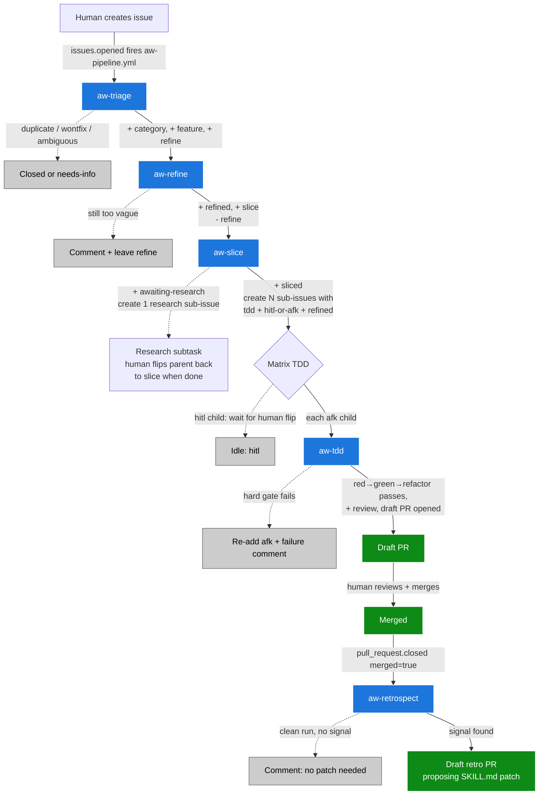

# Agentic Workflow (AW)

The AW pipeline turns a fresh GitHub issue into one or more reviewed pull requests, autonomously, with TDD discipline and human review gates. The system is built from five Claude Code skills and six GitHub Actions workflows, coordinated through a label state machine and the GitHub sub-issue API.

This document describes the system as it exists today, the design choices that shaped it, and how to extend it.

## Goals

- **Turn issues into PRs with discipline.** Every issue passes through triage → refine → slice → tdd before any code is written. Each subtask is implemented under red-green-refactor.
- **Human review at every shipping gate.** Draft PRs only — never auto-merge. Subtasks marked `hitl` (human-in-the-loop) wait for human approval before code is written. Skill patches go through draft PRs too.
- **Self-improving.** When a PR is merged, `aw-retrospect` looks for divergence between what the skill prescribed and what shipped, and proposes a skill patch. Skills get sharper over time.
- **Resilient.** Each stage is idempotent. State lives in labels — anyone (human or agent) can flip a label and the system recovers. Cron sweeps catch what events miss.
- **Cheap on tokens.** Workflow prechecks short-circuit empty queues before invoking the LLM. The pipeline workflow batches stages in one runner instead of paying setup cost per stage.

## Non-goals

- **Replacing human review.** Every PR opens as a draft. Every skill patch opens as a draft. Humans still merge.
- **Implementing arbitrary user requests at scale.** AW assumes well-bounded subtasks (3–6 per parent, ≤500 lines / ≤5 files per PR). Larger work needs human planning.
- **Cross-repo coordination.** Today the pipeline runs in one repo at a time. Multi-repo features (shared skills, propagated retros) are open future work.

## Stack

| Layer | Technology | Where |
| --- | --- | --- |
| Runtime | GitHub Actions | `.github/workflows/aw-*.yml` |
| Agent | `anthropics/claude-code-action@v1` | invoked from each workflow step |
| Auth | OAuth via `CLAUDE_CODE_OAUTH_TOKEN` repo secret | uses your Claude Code subscription quota |
| Skills | `.claude/skills/aw-<name>/SKILL.md` | one per pipeline stage |
| State | GitHub issue labels + sub-issue links | label state machine, `addSubIssue` GraphQL mutation |
| Branch convention | `claude/<entityType>-<issue-number>-<desc>` | claude-code-action default |

The skill files double as the canonical contract — every workflow's prompt is just *"Run the* `aw-<name>` *skill at* `.claude/skills/aw-<name>/SKILL.md`*"* plus a few hard-constraint reminders. The substance lives in the SKILL.md files, version-controlled in the repo. This means you can edit skill behavior without touching workflows, and you can run the same skill manually in your terminal (Claude Code auto-discovers `.claude/skills/`).

## Pipeline overview



## Label scheme

Labels are the state of the system. They drive what each workflow does.

### Action labels (mutually exclusive on a given issue)

These say "what's needed next." A workflow's precheck looks for its own action label, processes the issue, and replaces the action label with the next one in the chain.

| Label | On | Means | Set by | Removed by |
| --- | --- | --- | --- | --- |
| `refine` | parent | aw-refine should pick this up | aw-triage | aw-refine |
| `slice` | parent | aw-slice should pick this up | aw-refine (or human after research) | aw-slice |
| `awaiting-research` | parent | paused waiting on research subtask | aw-slice (research path) | human after research closes |
| `tdd` | subtask | aw-tdd should pick this up | aw-slice | aw-tdd |
| `review` | subtask | PR is open, human reviews | aw-tdd | (PR merge closes the issue) |

### State markers (accumulate as the pipeline progresses)

These say "what's already happened." They survive through the chain so you can query "all issues the agent has refined" or "all parents that have been sliced."

| Label | Means | Set by |
| --- | --- | --- |
| `feature` | top-level / parent issue marker | aw-triage |
| `refined` | aw-refine has rewritten the body | aw-refine |
| `sliced` | aw-slice has run on this parent (terminal at parent level) | aw-slice |

### Category labels (set by aw-triage, immutable through the pipeline)

| Label | Means |
| --- | --- |
| `bug` | broken behavior |
| `enhancement` | new functionality / improvement |
| `chore` | refactor, docs, tooling, dependency bump |

`enhancement` ≠ `feature`. `feature` is the *parent marker* (set on every triaged top-level issue regardless of category). `enhancement` is the *category* (set when the issue is a new capability). They coexist on a feature-request issue: `enhancement + feature + refine`.

### Execution gates (subtasks only)

| Label | Means | Effect |
| --- | --- | --- |
| `hitl` | human in the loop | aw-tdd skips. Human flips to `afk` when ready. |
| `afk` | agent may run autonomously | aw-tdd picks this up. |

Set by aw-slice on every child sub-issue (exactly one of `hitl` or `afk`). Heuristics for which to pick are in `.claude/skills/aw-slice/SKILL.md`.

### Closed states

| Label | Means |
| --- | --- |
| `wontfix` | closed without action; future similar issues should also be wontfix |
| `duplicate` | closed as a duplicate of another open or merged issue |

### Area labels (orthogonal — set by humans, not by skills)

`backend`, `frontend`, `rust`, `javascript`, `dependencies`, `documentation`. Skills don't set these but don't remove them either.

## Skill inventory

All skills live at `.claude/skills/aw-<name>/SKILL.md`. The skill body is the agent's instruction sheet: it describes inputs, the step-by-step process, label transitions, comment templates, and idempotency rules. Workflows read the skill file at runtime.

### `aw-triage`

**Triggered by:** `aw-pipeline.yml` on `issues.opened|reopened` (happy path) or `aw-triage.yml` on cron / dispatch (backstop for any open issue lacking a category).

**Inputs:** issue number.

**Process:**

1. Read the issue. Search for duplicates and prior `wontfix` matches via `gh search issues`.
2. Decide: duplicate → close + comment; wontfix-match → close + comment; ambiguous → comment asking for clarification, leave untriaged; otherwise classify into exactly one of `bug` / `enhancement` / `chore`.
3. Apply: category + `feature` + `refine`. Post a triage comment with the chosen category and any duplicates considered.

**Output:** issue with `<category>` + `feature` + `refine` (or closed as duplicate / wontfix, or untriaged with a clarifying comment).

**Constraints:** Never modifies title or body. Idempotent — if `feature` is already set, exits silently.

### `aw-refine`

**Triggered by:** `aw-pipeline.yml` (after aw-triage) or `aw-refine.yml` on cron / dispatch.

**Inputs:** issue number. Issue must have `refine` label and a category.

**Process:**

1. Read the issue.
2. Pick a template based on category (bug / enhancement / chore — see `aw-refine/SKILL.md`).
3. Rewrite the body into the outcome-oriented template. Preserve reproduction steps, error messages, and technical details verbatim.
4. Update labels: + `refined`, + `slice`, − `refine`. Post a refinement comment.

**Output:** issue with `<category>` + `feature` + `refined` + `slice`.

**Constraints:** Never modifies title unless it's genuinely not outcome-shaped. If the issue is too vague to confidently rewrite, posts a clarifying comment and leaves `refine` in place.

### `aw-slice`

**Triggered by:** `aw-pipeline.yml` (after aw-refine), `aw-slice.yml` on cron / dispatch / `issues.labeled` (specifically for the post-research re-slice path when a human flips `awaiting-research → slice`).

**Inputs:** parent issue number. Must have `feature` + `refined` + `slice`.

**Process:**

1. Read the parent. Decide whether the issue is **under-specified** (problem space, blocking unknowns, can't pick between technical alternatives) → research path. Otherwise proceed to value listing.
2. **Research-first path:** create ONE child sub-issue `Research: <question> for #<parent>`, labeled `chore + refined + tdd + hitl`. Update parent: − `slice`, + `awaiting-research`. Human (or aw-tdd if marked afk) does the research, posts findings, closes the subtask. Human flips parent back to `slice`. aw-slice re-runs with richer context.
3. **List the user values** the issue delivers. Each value is a sentence: "User can \[observable behaviour\]." Group values that share a single solution.
4. **Decide:** don't slice (the common case) OR slice into N value-aligned children.
   - **0 user values** — the issue describes only internal work. Post a clarification comment asking what user behaviour this enables. Leave `slice` in place. Stop.
   - **1 user value** (default) — DO NOT slice. The parent itself is the work unit. Update labels: − `slice`, + `tdd` + (`afk` or `hitl`). aw-tdd picks up the parent directly and produces ONE PR.
   - **N independent user values** — slice into N sub-issues, one per value. Each child: `<category> + refined + tdd + (afk|hitl)`. Children do NOT get `feature`. Update parent: − `slice`, + `sliced`.

**The decision rule:** *one PR = one shippable unit of user value.* A PR that delivers half a value (e.g. a settings store field with no consumer) is not a unit and should NOT be sliced out as its own subtask. Bundle it with the value it enables.

**HITL/AFK heuristics** (full list in SKILL.md):

- `hitl` if: changes a public API, schema migration, security policy, removes major dep, rewrites a file with &gt;10 callers, design-judgment criteria, research subtask
- `afk` if: localized, observable acceptance criteria, well-tested component, doc-only change, clear bug fix
- Default `hitl` when uncertain.

**Constraints:** Default to NOT slicing. Sub-issue links via GraphQL `addSubIssue` are mandatory when slicing — without them, the parent's UI doesn't show the children. Idempotent on `tdd`, `sliced`, or `awaiting-research`. Children inherit category from parent. Children do NOT get `feature` (only top-level parents do).

### `aw-tdd`

**Triggered by:** `aw-pipeline.yml`'s matrix tdd job (one parallel matrix entry per `afk` subtask), or `aw-tdd.yml` on cron / dispatch.

**Inputs:** issue number. Must have `tdd + afk + refined + <category>`. May or may not have `feature` (under the don't-slice default, parents themselves get `tdd + afk` and aw-tdd processes them as one PR; under the multi-value path, sub-issues without `feature` are the work units). Must NOT have `review` (already in PR) or be closed.

**Pre-flight:**

1. Read the subtask + its parent + sibling subtasks for context.
2. Check `Depends on:` blockers. If any are open, post a "blocked" comment and exit silently.
3. Read the files listed in "Files likely to change:" plus their tests and 1–2 levels of imports.
4. Remove `afk` from the subtask (claim it).

**Red-Green-Refactor:**

1. **Red:** write the failing tests exactly as listed in the subtask body. Run them. They MUST be RED. If any pass at this stage, the test is wrong or the bug isn't real — post a comment, fail closed.
2. **Green:** write the minimum implementation to make the tests pass. Re-run. They MUST all pass.
3. **Refactor:** if there's an obvious cleanup (extracted helper, deduplication) that doesn't change behavior, apply it. Re-run tests.

**Hard gates** (failing any aborts the run):

1. Red tests were red before green phase
2. Red tests are green after green phase
3. `pnpm test` passes (full suite)
4. `pnpm typecheck` passes
5. Lint passes (if a `lint` script exists)
6. No unrelated changes (`git diff --stat` only shows files listed in subtask body)

**On success:** create a `claude/<entityType>-<issue>-<desc>` branch, commit with `Implements #<issue>`, push, open a **draft** PR. Update subtask: + `review`, − `tdd`. Post done comment.

**On failure:** discard local changes, re-add `afk` (so cron retries see it), post a failure comment with the gate that failed and truncated error output.

**Constraints:** Never pushes to `main`. Always opens as draft. One subtask per run. Never modifies the issue body (that's aw-slice's authorship). Never modifies sibling subtasks.

### `aw-retrospect`

**Triggered by:** `aw-retrospect.yml` on `pull_request.closed` filtered to `merged == true && user.login == 'claude[bot]' && !startsWith(title, '[retrospect]')`.

**Inputs:** merged PR number.

**Process:**

1. Read the merged PR (title, body, diff, reviews, comments) and the linked issue (body, labels, all comments).
2. Identify which skill produced the PR (most likely `aw-tdd`, sometimes a research-subtask PR).
3. Look for **divergence signals** between what the skill prescribed and what shipped:
   - Diff vs declared scope (extra files touched)
   - Manual fixes after merge (next 5 commits to main)
   - Review comments / pushback
   - Title or body edited
   - Tests changed during review
   - Re-runs (failure comment then success)
4. Decide: strong signal → propose patch; weak signal → skip; no signal → post a positive retro comment, do not open a PR.
5. **If proposing a patch:** read the relevant SKILL.md, make the minimum edit, branch `claude-retro/<issue>-<skill>`, commit `docs(skill): retrospect from #<PR> — <summary>`, open a **draft** PR titled `[retrospect] aw-<skill>: <summary>`.
6. Post a comment on the merged PR linking to the retro PR (or noting "no retro action needed").

**Constraints:** Never modifies a SKILL.md directly on main — always through a PR. One skill patched per retro, max. Skips retro PRs (don't retro on retros). Idempotent — if a retro PR already exists for this merged PR, exits silently.

## Workflow architecture

Six workflow files. One *pipeline* + four *standalones* + one *retrospect*.

### `aw-pipeline.yml` — the happy path

Triggered on `issues: types: [opened, reopened]`. Single workflow with four jobs chained via `needs:`:

```
triage (job)
  ↓ outputs.classified
refine (job, if classified)
  ↓ outputs.ready
slice (job, if ready)
  ↓ outputs.subtasks (JSON array of afk subtask numbers)
tdd (matrix job, max-parallel: 3, fail-fast: false)
```

Each job spins up its own runner but the jobs run back-to-back without waiting for separate GH Actions trigger latency. Matrix at the tdd stage parallelizes implementation of `afk` subtasks (`hitl` subtasks are skipped — they wait for human approval before tdd runs).

**Concurrency:** keyed on `aw-pipeline-<issue-number>`. Reopening or editing the issue while the pipeline is running won't cancel it.

### Standalone backstops

`aw-{triage,refine,slice,tdd}.yml`. Each has:

- `schedule: */15 * * * *` cron
- `workflow_dispatch:` with optional `issue_number` input
- A bash precheck that finds one eligible candidate (or skips with `candidates=` empty)
- An `if: steps.find.outputs.candidates != ''` guard on the LLM step (zero token cost on empty sweeps)

Standalone `aw-slice.yml` ALSO listens to `issues: types: [labeled]` to pick up the post-research flip (human flips `awaiting-research → slice`). This is the only standalone with an event trigger.

To prevent a race between `aw-pipeline.yml` and `aw-slice.yml` (when pipeline's refine job adds the `slice` label, that fires `issues.labeled`, which would also trigger `aw-slice.yml`) AND to silence the skipped-run noise that previously appeared on every label change, the standalone has:

```yaml
if: |
  github.event_name != 'issues' ||
  (github.actor != 'claude[bot]' && github.event.label.name == 'slice')
```

The `if:` skips the issues-event path unless a HUMAN adds the specific `slice` label — i.e., the post-research re-slice path (human flips `awaiting-research → slice` after a research subtask closes). Cron and `workflow_dispatch` runs are unaffected. All other label changes — bot-added, or human-added but not `slice` — produce no run.

### `aw-retrospect.yml`

Fires on `pull_request: types: [closed]`, gated by:

```yaml
if: |
  github.event.pull_request.merged == true &&
  github.event.pull_request.user.login == 'claude[bot]' &&
  !startsWith(github.event.pull_request.title, '[retrospect]')
```

20-minute timeout. `--allowedTools "Bash(gh:*),Read,Edit,Write,Grep,Glob"` — Edit + Write needed for proposing skill patches.

## Lifecycle: from issue creation to merged PR

Worked example: human opens an issue describing a bug.

| Step | Actor | Action | Resulting issue state |
| --- | --- | --- | --- |
| 1 | Human | `gh issue create --title "..." --body "..."` | `(no labels)` |
| 2 | aw-pipeline.yml | `issues.opened` event fires the pipeline | (pipeline starts) |
| 3 | triage job | runs aw-triage skill | `bug + feature + refine` |
| 4 | triage job | precheck output: `classified=true` | (clarify gate passed) |
| 5 | refine job | runs aw-refine skill | `bug + feature + refined + slice` (`refine` removed; body rewritten) |
| 6 | refine job | precheck output: `ready=true` | (slice gate passed) |
| 7 | slice job | runs aw-slice skill | `bug + feature + refined + sliced` (parent terminal) |
| 7a | aw-slice (within slice job) | creates 3 sub-issues via `gh issue create + addSubIssue` mutation | each child: \`bug + refined + tdd + (afk |
| 8 | slice job | collects afk children for matrix | `outputs.subtasks=[#65, #66, #67]` |
| 9 | tdd matrix (3 parallel jobs) | each runs aw-tdd skill on its subtask | each child briefly `bug + refined + tdd` (after `afk` removal at start) |
| 9a | aw-tdd | red-green-refactor + hard gates | (work happens on `claude/...` branch) |
| 9b | aw-tdd | opens draft PR, updates child labels | child: `bug + refined + review` (`tdd` removed) |
| 10 | Human | reviews draft PR, marks ready, merges | child issue closed via `Implements #N` link |
| 11 | aw-retrospect.yml | `pull_request.closed merged=true` event fires | (retrospect job starts) |
| 12 | aw-retrospect | reads merged PR + issue + originating skill | (analyzes for divergence) |
| 13 | aw-retrospect | finds signal (e.g. agent touched extra files) | opens draft PR `[retrospect] aw-tdd: ...` |
| 14 | Human | reviews retro PR, merges (or rejects) | SKILL.md updated for future runs |

Total wall time on a typical issue: \~15-20 minutes from `gh issue create` to draft PRs in matrix tdd.

## Failure modes and recovery

### Pre-existing labeled issues cascading on deploy

**What happened:** When we first deployed the planner workflow, any pre-existing issue with the old `enhanced` label became a candidate. The cron picked them up immediately and started auto-creating subtasks for issues that had been hand-planned years ago.

**Fix:** introduced `slice` action label as an explicit gate. Bare `refined` (formerly `enhanced`) doesn't trigger anything — only `slice` does. New issues going through aw-refine get both `refined` (state) and `slice` (action). Pre-existing `enhanced` issues from before the deploy can be migrated by hand without triggering the planner.

**Lesson:** Action labels need explicit gates that are NOT automatically retro-applied to existing data.

### Bot-triggered chain blocked by `allowed_bots`

**What happened:** When aw-triage adds the `bug` label, that fires `issues.labeled` for downstream workflows. claude-code-action defaults to refusing bot-initiated runs ("Workflow initiated by non-human actor: claude (type: Bot). Add bot to allowed_bots list or use '\*'").

**Fix:** added `allowed_bots: "claude[bot]"` to all downstream workflows. Specifically not `"*"` because the repo is public and `"*"` would let external apps trigger the action.

**Lesson:** when chaining workflow events, the actor is whoever ran the previous workflow — usually the bot. Action invocations need explicit bot allowance.

### Pipeline + standalone race on `slice` label

**What happened:** When pipeline's refine job adds the `slice` label, that fires `issues.labeled`, which triggers BOTH the pipeline's slice job (via `needs:`) AND the standalone aw-slice.yml (via the `issues: types: [labeled]` trigger). Both would call the agent on the same issue in parallel — double work and conflicting label updates.

**Fix (v1):** added `if: github.event_name != 'issues' || github.actor != 'claude[bot]'` at the standalone's job level. Skips bot-triggered events; only fires on human label changes (post-research re-slice) + cron + dispatch.

**Fix (v2 — noise reduction):** the v1 guard correctly prevented the race but every human-added label change to any issue still created a "skipped" run, polluting the run list. Tightened to also require the specific label being added:

```yaml
if: |
  github.event_name != 'issues' ||
  (github.actor != 'claude[bot]' && github.event.label.name == 'slice')
```

Now the standalone only fires on the one event we actually want — a human adding the `slice` label.

**Lesson:** when the same event triggers both a pipeline and a standalone, explicit actor-based filtering separates concerns; tightening to the specific label being added eliminates run-list noise without losing functionality.

### Subtask blocked by `Depends on:`

**Behavior:** aw-tdd's pre-flight reads the subtask body for `Depends on: #N` references. If any blocker is open, posts a "blocked" comment and exits silently. Cron retries when blocker closes.

**Recovery:** automatic. When the blocker is merged + closed, the next aw-tdd cron tick picks up the unblocked subtask.

**Known issue:** during testing (matrix tdd run on #64), a subtask blocked on its sibling didn't post the "blocked" comment as the skill prescribes — labels also weren't fully reset. This is a real signal for aw-retrospect to catch.

### Hard gate failure in aw-tdd

**Behavior:** any of red-not-red / green-not-green / `pnpm test` fail / typecheck fail / lint fail / unrelated files modified → discard local changes, re-add `afk`, post failure comment, exit. No PR opens.

**Recovery:** human reads the failure comment. Either:

- Fix the issue body (red-test list might be wrong), let cron pick it up again
- Flip to `hitl`, implement manually
- Close as `wontfix` if no longer relevant

### Auth failure (invalid OAuth token)

**Symptom:** `Action failed with error: SDK execution error: ... 401 ... Invalid bearer token`.

**Recovery:** regenerate token via `claude setup-token` and re-set the repo secret: `gh secret set CLAUDE_CODE_OAUTH_TOKEN`.

### Workflows accidentally enabled / cron firing during refactor

**Mitigation:** disable workflows during structural refactors (`gh workflow disable <name>.yml`). Re-enable via `gh workflow enable` after pushing the changes. Cancellable via `gh run cancel <run-id>` for in-progress runs.

## Design choices and rationale

The current shape of AW is the result of several pivots during development. This section captures *why* we chose what we chose.

### Choice: `aw-` prefix (not `wf-`, not `awf-`)

We started with `wf-` (workflow). Renamed to `aw-` (agentic workflow) because:

- `wf-` is generic and overlaps with non-AI workflow tooling
- `aw-` ties the namespace to "agentic workflow" which is the literature term
- Three letters (`awf-`) was considered but two reads cleaner once the meaning is fixed

The prefix groups the dev-process skills visually away from the regular Claude Code audit/review/test skills (which use category-prefix conventions like `audit-*`, `review-*`, `test-*`). A glance at the skill list tells you "this skill is part of the AW pipeline."

### Choice: action labels + state markers (not single-state labels)

A naive design uses one label per state: `triaged`, `refined`, `sliced`, etc. Workflows query by the current state.

We chose two coexisting categories:

- **Action labels** (mutually exclusive): `refine`, `slice`, `awaiting-research`, `tdd`, `review`. Says what's needed next.
- **State markers** (accumulate): `feature`, `refined`, `sliced`. Says what's already happened.

Why both? Two reasons:

1. **Queryability.** With state markers, you can ask "show me all issues that have been refined" with `gh issue list --label refined`, even after they've moved on to slicing or sliced. Single-state labels hide history.
2. **Decoupling action from state.** An issue can have `refined` (history) but no current action label — it's "done at parent level." That's `sliced` (terminal). Single-state collapses this distinction.

Tradeoff: more labels to manage. Worth it for the queryability.

### Choice: `feature` as a parent marker (not a category)

We needed a way to distinguish parent issues from sub-issues in the issue list view (GitHub's UI hides parent/child relationships in the flat list).

Options considered:

- `top-level` — descriptive but verbose
- `parent` — concise, slightly ambiguous (is a parent without children still a parent?)
- `epic` — Agile/JIRA convention, heavyweight feel
- `feature` — chosen

`feature` overlaps with `enhancement` (the category for "new functionality"), but they're conceptually different: `feature` = "is this a top-level work item or a subtask?", `enhancement` = "is this a bug, new capability, or chore?" They coexist on a feature-request issue: `enhancement + feature + refine`.

### Choice: research is a subtask, not a separate skill

Originally we planned a `feature-research` skill for issues that were too vague to slice directly. After further thought, we collapsed it into aw-slice's research-first path. Reasons:

1. Fewer skills to maintain
2. Research becomes a regular subtask (with `tdd + hitl` labels), indistinguishable from any other in the queue
3. Re-planning after research closes is just another aw-slice run
4. Removes the `awaiting-human` state entirely — `awaiting-research` is enough

### Choice: one PR = one shippable user value (not "one PR per layer")

**The pivot.** Originally aw-slice defaulted to slicing every refined issue into 3–6 sub-issues, each delivering one horizontal layer (settings store field, then CSS variable, then drag handle, then clamp logic, then docs). After the first end-to-end test, the failure mode was obvious: PR spam, no shippable features. Each PR was one layer; the user only got working software after 4–5 PRs stacked up. Plus the depends-on chain between layers was implicit and unwritten — aw-tdd produced PR #78 documenting CSS variables that didn't exist yet because the implementation PRs hadn't merged.

**The new rule:** *one PR = one shippable unit of user value.* The unit is "user value," not "issue" and not "layer." A PR that delivers half a value (a settings field with no consumer; a CSS variable with no UI) is NOT a unit on its own — it ships INSIDE the PR that delivers the value it enables.

aw-slice's decision becomes:

1. List the user values: each is a sentence "User can \[observable behaviour\]."
2. Group values that share a single solution.
3. **0 user-value entries** → comment-and-stop (issue describes only internal work).
4. **1 user-value entry** (the common case) → don't slice. Mark the parent itself with `tdd + (afk|hitl)` and pass directly to aw-tdd.
5. **N independent user-value entries** → slice into N sub-issues, one per value.

**Test for groupings:** *if I stop here (after this PR merges), has the user gained something concrete?* Yes → ship. No → bundle with the value it enables.

**Why this works for feature flags.** A PR that delivers one complete user value is the natural unit for a feature flag: gate the merge with `if (flag.featureName)`, ramp it to opt-in users, evaluate, expand or roll back. A horizontal-layer PR can't be flag-gated meaningfully — the flag would point at machinery the user can't see.

**Tradeoff with TDD red phase.** When aw-tdd runs on a parent (don't-slice path), it may receive a longer red-test list spanning multiple files. That's fine — the test list expresses the BEHAVIOR being delivered, not the lines of code. Multiple files in one PR is appropriate when they deliver one user value cohesively.

### Choice: pipeline workflow + standalone backstops (not pure event-chain)

The naive design has each workflow event-trigger the next: aw-triage's label add fires aw-refine via `issues.labeled`, which fires aw-slice, etc.

Problems with pure event-chain:

- \~30s runner spin-up per stage = \~120s wasted setup over a 4-stage pipeline
- Each event is a separate billable runner minute
- Sequential `issues.labeled` events introduce latency between stages
- Concurrency cancellations when triggers race

We chose a hybrid:

- **Pipeline workflow** (`aw-pipeline.yml`) for the happy path. Single workflow, four jobs chained via `needs:`, matrix tdd. One trigger (`issues.opened`), all stages run back-to-back.
- **Standalone workflows** (`aw-triage.yml`, etc.) as backstops. Cron sweeps + `workflow_dispatch` only (no event triggers, except aw-slice keeps `issues.labeled` for the post-research re-slice case).

The pipeline pays the runner spin-up cost once per stage (still 4 setups), but they happen back-to-back without waiting for separate event triggers. Matrix tdd parallelizes implementation. Standalones pick up anything the pipeline missed (failure recovery, post-research re-slicing, manual reruns).

### Choice: claude-code-action with OAuth (not gh-aw, not API key)

We started designing with `gh-aw` (GitHub Agentic Workflows extension by GitHub Next). Discovered that gh-aw's `engine: claude` hard-codes `ANTHROPIC_API_KEY` — does NOT expose claude-code-action's `claude_code_oauth_token` input.

Switched to raw `claude-code-action@v1` so we could use OAuth via `CLAUDE_CODE_OAUTH_TOKEN`. This bills against the user's Claude Code subscription quota (Pro/Max), not against pay-per-token API rates.

What we lost: gh-aw's declarative `safe-outputs` allowlist, `skip-if-match` cron deduplication, container firewall sandboxing. We rebuilt these in raw YAML:

- Safe-outputs equivalent → guardrails written into the SKILL.md prompts (e.g. "apply at most one of bug/enhancement/chore")
- skip-if-match equivalent → bash precheck that queries for candidates before invoking the LLM
- Concurrency control → standard GH Actions `concurrency: group:` keyed per issue

Result: \~25-line workflow YAMLs. Cleaner for our use case than the gh-aw markdown source + compiled `.lock.yml` pair.

### Choice: TDD red-green-refactor at the subtask level

aw-tdd verifies that red tests are RED *before* writing any implementation. If a test passes from the start, that means either the test is wrong or the bug isn't real — both are signals to stop and ask.

This is stricter than typical "agent writes tests + code together" patterns. Reasons:

1. **Catches misunderstanding cheaply.** If aw-slice generated a wrong red-test list, aw-tdd notices on the first run instead of producing code that ships passing tests for the wrong thing.
2. **Forces bug confirmation.** A test that's already green means the bug we thought we were fixing isn't actually broken. Without the red phase, we'd ship a no-op fix.
3. **Aligns with human TDD practice.** The skill's discipline matches what a careful human developer would do; the artifacts (tests, implementations) read naturally.

### Choice: HITL/AFK gates on subtasks

Subtasks created by aw-slice get exactly one of:

- `afk` — agent can implement autonomously
- `hitl` — human approves before agent runs

aw-slice picks based on heuristics (public API change, schema migration, security policy, file with many callers, design judgment, research = `hitl`; localized + observable + well-tested = `afk`). When uncertain, defaults to `hitl`.

This is the ONLY autonomy gate in the system besides "draft PR" (which is always required). Without it, every subtask would auto-execute as soon as it's created, with no human review until the PR opens. With it, a human can flip `hitl → afk` after a quick review.

### Choice: aw-retrospect on every merge

The retrospective skill is a self-improvement loop. After a claude\[bot\]-authored PR merges, it looks for divergence between what the originating skill prescribed and what shipped — extra files touched, manual fixes after merge, review pushback, test changes, etc. — and proposes a SKILL.md patch.

The patch goes through a draft PR. Humans always review. Skills get sharper over time.

This is heavily inspired by the rmstdope/my-copilot `self-learning-skills` pattern, adapted to the action-label state machine.

## Working with the system

### Adding a new skill

1. Create the skill directory: `mkdir -p .claude/skills/aw-<name>`
2. Write `.claude/skills/aw-<name>/SKILL.md`. Frontmatter: `name:` and `description:`. Body: inputs, process, output rules, comment templates, idempotency rule, constraints from the dev process.
3. Decide where it fits in the pipeline (e.g. between aw-refine and aw-slice). Pick action labels for "before" and "after" states.
4. Create the workflow file: `.github/workflows/aw-<name>.yml`. Mirror the pattern of an existing standalone (cron + dispatch + bash precheck + claude-code-action invocation). Add `allowed_bots: "claude[bot]"` if it'll be triggered by a bot-added label.
5. Update `aw-pipeline.yml` to include the new stage as a job with `needs:` on the previous stage.
6. Add the new action label(s) on the repo via `gh label create`.
7. Update this doc.

### Adding a new label

1. Create the label: `gh label create <name> --color "<hex>" --description "..."`.
2. Update the relevant SKILL.md and workflow YAML(s) to apply or look for it.
3. Update the "Label scheme" section of this doc.
4. If migrating issues with old labels, write a migration script using `gh issue edit` + `gh label edit`.

### Renaming an existing skill

1. `git mv .claude/skills/aw-<old> .claude/skills/aw-<new>`
2. `git mv .github/workflows/aw-<old>.yml .github/workflows/aw-<new>.yml`
3. Substitute all references across files: `perl -pi -e 's/\baw-<old>\b/aw-<new>/g; s|\.claude/skills/aw-<old>/|.claude/skills/aw-<new>/|g; s/^name: AW — <Old>$/name: AW — <New>/g' .claude/skills/aw-*/SKILL.md .github/workflows/aw-*.yml`
4. Update display name + concurrency group in the renamed workflow file.
5. Validate YAML, commit, push.
6. Re-enable the renamed workflow if it's tracked as a new file: `gh workflow enable aw-<new>.yml`.

### Tuning cron cadence

Each standalone workflow has `schedule: */15 * * * *`. Change to `*/5` for more responsive backstop or `0 * * * *` for hourly. Test costs are minimal — empty sweeps short-circuit at the precheck step (zero LLM tokens) and consume runner minutes only on actual work (and the repo is public, so runner minutes are free).

### Onboarding a new repo

To deploy AW in another repo:

1. Copy `.claude/skills/aw-*/` and `.github/workflows/aw-*.yml`. Update `PeterBlenessy/notesage` references in the workflow prompts to the new owner/repo.
2. Set up the `CLAUDE_CODE_OAUTH_TOKEN` repo secret (`claude setup-token` + `gh secret set`).
3. Create the AW labels: feature, refine, refined, slice, sliced, awaiting-research, tdd, review, hitl, afk, plus your category labels (bug/enhancement/chore).
4. Decide whether to disable the workflows initially to migrate any pre-existing issues without triggering cascades. Re-enable after migration.
5. Test on a synthetic issue before letting it run on real ones.

### Monitoring

- `gh workflow list` — see all workflows and their status
- `gh run list --workflow aw-pipeline.yml --limit 10` — recent pipeline runs
- `gh run view <run-id>` — drill into a specific run
- `gh issue list --label "feature"` — all top-level AW issues
- `gh issue list --label "tdd" --label "afk"` — eligible-for-tdd subtasks
- `gh pr list --draft` — draft PRs awaiting review
- `gh pr list --state open --search "is:open author:app/claude"` — PRs authored by the agent

## Open questions and future work

### Multi-repo support

Today AW runs in one repo at a time. Cross-repo features that would be valuable:

- **Shared skill registry** — one repo holds the canonical SKILL.md files; other repos import via git submodule or sparse checkout.
- **Cross-repo retros** — when a similar issue is opened in repo A and later in repo B, aw-retrospect could detect the pattern and propose a skill patch upstream.
- **Shared label schema** — propagate label changes (rename, color) across repos.

### Better retrospect signals

The current divergence-signal heuristics in `aw-retrospect/SKILL.md` are basic (extra files, post-merge fixes, review comments, etc.). Possible improvements:

- **Diff parsing** — recognize specific anti-patterns (e.g. agent kept adding TODOs, agent over-tested, agent under-tested edge cases).
- **Time-to-merge correlation** — if PRs from a specific skill take much longer to merge than baseline, the skill's instructions might be unclear.
- **Aggregate retros** — instead of one-PR-at-a-time, periodically run a "retro across last 10 merges" to find patterns.

### Cost monitoring / quota tracking

Currently no visibility into how much subscription quota AW consumes. Could add:

- A `quota` workflow that reports daily token usage by skill
- Per-skill cost ceilings (e.g. aw-tdd costs more than aw-triage; track separately)
- Alert when approaching subscription cap

### Skill versioning

SKILL.md files are version-controlled but there's no formal versioning scheme. Possible approaches:

- Frontmatter `version:` field that bumps on significant rule changes
- Changelog at the bottom of each SKILL.md
- Tag-based versioning so the action can pin to a specific skill version (`@v1`)

### Pipeline observability

The pipeline is opaque while running. Could add:

- Structured logging with `[aw:<skill>]` prefixes (similar to the app's `[perf:*]` pattern)
- A "dashboard" issue per parent that auto-updates with progress
- Slack/Discord notifications on pipeline failures

### Removing the depends-on label-state bug

Caught during the #64 test: when a subtask is blocked on a sibling, aw-tdd doesn't always update labels correctly (sometimes `tdd` stays on, sometimes `afk` doesn't get re-added). A retrospect run on the next clean merge should propose a SKILL.md fix. Until then, manual cleanup may be needed if cron runs on stuck labels.

## Glossary

- **AW** — Agentic Workflow. The pipeline described in this doc.
- **Action label** — a mutually-exclusive label that says "what's needed next" (`refine`, `slice`, `tdd`, etc.).
- **State marker** — a label that accumulates as the pipeline progresses (`feature`, `refined`, `sliced`).
- **Parent issue** — a top-level issue, marked with `feature`. The original user-reported bug or feature request.
- **Subtask / sub-issue / child issue** — created by aw-slice as a sub-issue of a parent. Has its own number, body, and labels. Linked via the `addSubIssue` GraphQL mutation.
- **HITL** — human in the loop. A subtask labeled `hitl` waits for human approval before aw-tdd runs.
- **AFK** — agent-OK-to-run-autonomously. A subtask labeled `afk` is picked up by aw-tdd without human approval.
- **Hard gate** — a check in aw-tdd that, if failed, aborts the run and reverts changes (red-not-red, tests fail, etc.).
- **Pipeline workflow** — `aw-pipeline.yml`. The single workflow with sequential jobs that runs the happy path on issue creation.
- **Standalone workflow** — `aw-triage.yml`, etc. Backstops on cron + dispatch.
- **Retro PR** — a draft PR opened by aw-retrospect proposing a SKILL.md patch.