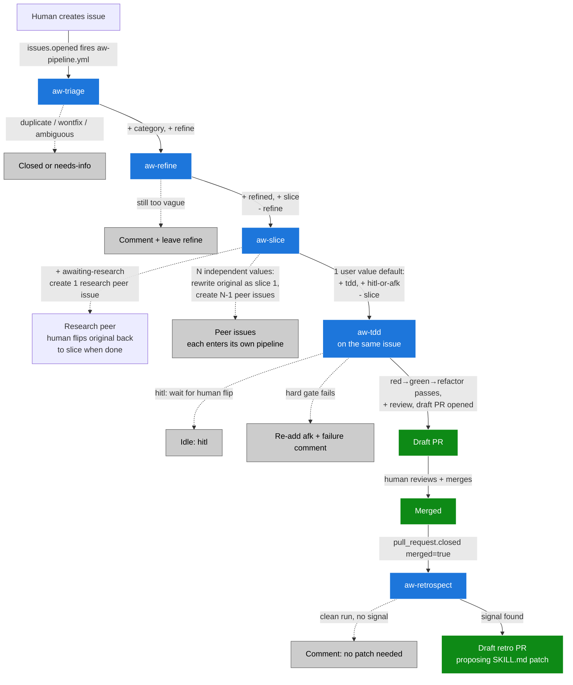

# Agentic Workflow (AW)

The AW pipeline turns a fresh GitHub issue into a reviewed pull request, autonomously, with TDD discipline and human review gates. Five Claude Code skills, six GitHub Actions workflows, coordinated through a label state machine.

This document captures the system as it stands today and the design choices that shaped it. Skill rules live in `.claude/skills/aw-<name>/SKILL.md` (the source of truth for agent behavior).

## Goals

- **Turn issues into PRs with discipline.** Every issue passes through triage → refine → slice → tdd. Each PR is implemented under red-green-refactor.
- **Human review at every shipping gate.** Draft PRs only, never auto-merge. Issues marked `hitl` wait for human approval before code is written. Skill patches go through draft PRs.
- **Self-improving.** On PR merge, `aw-retrospect` proposes skill patches based on what diverged. Skills get sharper over time.
- **Resilient.** Each stage is idempotent. State lives in labels — anyone can flip a label and the system recovers. Cron sweeps catch what events miss.
- **Cheap on tokens.** Bash prechecks short-circuit empty queues before invoking the LLM. The pipeline workflow runs stages back-to-back rather than separate event-triggered runs.

## Non-goals

- **Replacing human review.** Every PR opens as a draft. Every skill patch opens as a draft. Humans still merge.
- **Implementing arbitrary user requests at scale.** AW assumes one PR fits a shippable unit of user value. If too large, aw-slice splits it into peer issues — each must still ship something useful. Larger work needs human planning.
- **Cross-repo coordination.** One repo at a time today. Multi-repo features are open future work.

## Stack

| Layer | Technology | Where |
| --- | --- | --- |
| Runtime | GitHub Actions | `.github/workflows/aw-*.yml` |
| Agent | `anthropics/claude-code-action@v1` | invoked from each workflow step |
| Auth | OAuth via `CLAUDE_CODE_OAUTH_TOKEN` | uses Claude Code subscription quota |
| Skills | `.claude/skills/aw-<name>/SKILL.md` | one per pipeline stage |
| State | GitHub issue labels | label state machine |

The skill files double as the canonical contract — every workflow's prompt is just *"Run the* `aw-<name>` *skill at* `.claude/skills/aw-<name>/SKILL.md`*"* plus a few hard-constraint reminders. Substance lives in the SKILL.md files.

## Pipeline overview

## Label scheme

Labels are the state of the system.

**Action labels** (mutually exclusive — what's needed next):

| Label | Means | Set by | Removed by |
| --- | --- | --- | --- |
| `refine` | aw-refine should pick up | aw-triage | aw-refine |
| `slice` | aw-slice should pick up | aw-refine (or human after research) | aw-slice |
| `awaiting-research` | paused on research peer | aw-slice (research path) | human |
| `tdd` | aw-tdd should pick up | aw-slice | aw-tdd |
| `review` | PR is open | aw-tdd | (PR merge closes the issue) |

**State markers** (accumulate, queryable history):

| Label | Means | Set by |
| --- | --- | --- |
| `refined` | aw-refine has rewritten the body | aw-refine |

**Categories** (set by aw-triage, immutable): `bug`, `enhancement`, `chore`.

**Execution gates** (on any tdd-ready issue, mutually exclusive): `hitl`, `afk`.

**Closed states**: `wontfix`, `duplicate`.

## Skills

Each skill is a markdown file with action rules. Workflows just point the agent at it. SKILL.md is the source of truth for behavior.

| Skill | Job | When | Output |
| --- | --- | --- | --- |
| `aw-triage` | Classify, dedup, close-or-categorize | issue opened, or cron | category + `refine`, OR closed as duplicate/wontfix |
| `aw-refine` | Rewrite body to outcome template (bug / enhancement / chore variants) | `refine` label set | `+ refined`, `+ slice` |
| `aw-slice` | Decide one PR vs N peer issues vs research | `slice` label set | one of: `+ tdd + (afk|hitl)`, OR N peer issues + first slice = original, OR `+ awaiting-research` |
| `aw-tdd` | TDD red-green-refactor + draft PR | `tdd + afk + refined + category` | `+ review`, draft PR |
| `aw-retrospect` | Look for divergence on merged PR, propose SKILL.md patch | `pull_request.closed` + merged + claude\[bot\] | draft PR with skill edit, OR no-signal comment |

**The slice decision** is the most important skill rule. aw-slice asks: "what user values does this issue deliver?" Each value is a sentence "User can \[observable behaviour\]." Then:

- **0 values** → comment-and-stop (issue is internal-only).
- **1 value** (the common case) → don't slice. Mark the issue `tdd + (afk|hitl)` and pass to aw-tdd.
- **N independent values** → split into peer issues. Original becomes the first slice (rewrite body). Create N-1 new peers.

The unit is **user value**, not "issue" and not "layer." A PR that delivers half a value (settings store field with no consumer) is not a unit on its own — it ships INSIDE the PR that delivers the value it enables.

## Workflows

Six workflow files. One *pipeline* + four *standalones* + one *retrospect*.

| Workflow | Triggers | Purpose |
| --- | --- | --- |
| `aw-pipeline.yml` | \`issues.opened | reopened\` |
| `aw-triage.yml` | cron `*/15`, `workflow_dispatch` | Backstop for any open issue lacking a category |
| `aw-refine.yml` | cron, dispatch | Backstop for `refine`-flagged issues |
| `aw-slice.yml` | cron, dispatch, `issues.labeled` (human-added `slice` only) | Backstop + post-research re-slice path |
| `aw-tdd.yml` | cron, dispatch | Backstop for `tdd + afk` issues |
| `aw-retrospect.yml` | `pull_request.closed` | Self-improvement on merge |

Each workflow has a bash precheck that finds candidates before invoking the LLM (zero token cost on empty sweeps). Cron tick is every 15 minutes.

## Lifecycle (worked example, default path)

| Step | Issue state |
| --- | --- |
| Human creates issue | (no labels) |
| aw-pipeline.yml fires; aw-triage classifies | `bug + refine` |
| aw-refine rewrites body | `bug + refined + slice` |
| aw-slice: 1 user value, don't slice | `bug + refined + tdd + afk` |
| aw-tdd: red-green-refactor + draft PR | `bug + refined + review` |
| Human merges PR | issue closed via `Implements #N` |
| aw-retrospect: looks for divergence | optional draft retro PR |

Total wall time: \~10–15 min from `gh issue create` to draft PR.

## Failure modes

**Auth failure (OAuth token invalid):** action fails with `401 Invalid bearer token`. Regenerate via `claude setup-token` + `gh secret set CLAUDE_CODE_OAUTH_TOKEN`.

**Hard gate failure in aw-tdd:** any of red-not-red / `pnpm test` / typecheck / lint / unrelated-files-modified → revert local changes, re-add `afk`, post failure comment. Human investigates.

**Pipeline + standalone race:** when pipeline's bot adds a label, the same event would fire the standalone workflow. Mitigated by job-level guards: `aw-slice.yml` requires `github.actor != 'claude[bot]' && github.event.label.name == 'slice'`. Skips bot-triggered events; only fires on human label changes (post-research re-slice) + cron + dispatch.

**Bot-chain blocked:** by default, `claude-code-action` refuses bot-initiated runs. Each downstream workflow has `allowed_bots: "claude[bot]"` to permit chained triggers.

## Design choices and rationale

The current shape of AW is the result of several pivots. This section captures *why*.

### Choice: `aw-` prefix (not `wf-`, not `awf-`)

We started with `wf-` (workflow) and renamed to `aw-` (agentic workflow). `aw-` ties the namespace to the literature term and groups dev-process skills visually away from regular Claude Code audit/review/test skills. A glance at the skill list tells you "this skill is part of the AW pipeline."

### Choice: action labels + state markers (not single-state labels)

A naive design uses one label per state. We chose two coexisting categories: action labels (mutually exclusive — what's needed next) and state markers (accumulate — what's already happened). State markers let you query history (`gh issue list --label refined`) even after issues move forward. Action labels keep the immediate "what to do now" obvious. Cost: more labels. Worth it for the queryability.

### Choice: one PR = one shippable user value (not "one PR per layer")

**The pivot.** Originally aw-slice defaulted to slicing every refined issue into 3–6 sub-issues, each delivering one horizontal layer (settings store field, then CSS variable, then drag handle, then clamp logic, then docs). The failure mode was obvious: PR spam, no shippable features. Each PR was one layer; the user only got working software after 4–5 PRs stacked. PR #78 documented CSS variables that didn't exist yet because the implementation PRs hadn't merged.

**The new rule:** *one PR = one shippable unit of user value.* aw-slice asks "what can a user DO after this PR merges?" Each answer is a value. If 1 → don't slice (the common case). If N → split into peer issues.

**Test for groupings:** *if I stop here, has the user gained something concrete?* Yes → ship. No → bundle with the value it enables.

**Why this works for feature flags.** A PR that delivers one complete user value is the natural unit for a flag: gate the merge with `if (flag.featureName)`, ramp to opt-in users, evaluate, expand or roll back. A horizontal-layer PR can't be flag-gated meaningfully — the flag would point at machinery the user can't see.

### Choice: peer issues, not sub-issues, on multi-value split

Originally aw-slice created GitHub sub-issues (parent/child via the `addSubIssue` GraphQL mutation). After adopting the value-based rule, sub-issues became unused: 1-value (default) doesn't slice at all; N-value splits work better as peer issues that each independently ship.

When aw-slice splits an issue into N values, the original issue becomes the FIRST slice (body rewritten in place — keeps history, comments, the original number). N-1 new peer issues are created with `Split from #<original>` reference. No GraphQL parent/child link.

Consequence: dropped the `feature` (parent marker) and `sliced` (parent terminal state) labels. Without parent/child, both are redundant.

### Choice: research is a peer issue, not a separate skill

Originally we planned a `feature-research` skill. We collapsed it into aw-slice's research path: when under-specified, aw-slice creates ONE peer issue titled `Research: <question>` and marks the original `awaiting-research`. Human (or aw-tdd if `afk`) does the research, posts findings, closes the research issue. Human flips the original back to `slice` to re-trigger.

Fewer skills to maintain. Research becomes a regular peer issue, indistinguishable from any other in the queue.

### Choice: pipeline workflow + standalone backstops (not pure event-chain)

The naive design has each workflow event-trigger the next: aw-triage's label add fires aw-refine via `issues.labeled`, etc. Problems: \~30s runner spin-up per stage = \~120s wasted setup; each event is a separate billable runner minute; sequential events introduce latency; concurrency cancellations when triggers race.

We chose a hybrid: pipeline workflow for the happy path (one trigger, jobs chained via `needs:`); standalone workflows as backstops (cron + dispatch only, plus aw-slice keeps `issues.labeled` for the post-research re-slice case). Pipeline pays the runner spin-up once per stage but stages run back-to-back. Standalones pick up anything the pipeline missed.

### Choice: claude-code-action with OAuth (not gh-aw, not API key)

Started designing with `gh-aw` (GitHub Agentic Workflows). Discovered gh-aw's `engine: claude` hard-codes `ANTHROPIC_API_KEY` and doesn't expose claude-code-action's `claude_code_oauth_token` input. Switched to raw `claude-code-action@v1` so we could use OAuth (subscription quota, not pay-per-token).

What we lost from gh-aw: declarative `safe-outputs`, `skip-if-match` cron deduplication, container firewall sandboxing. We rebuilt these in raw YAML — guardrails into SKILL.md prompts, bash precheck for dedup, standard `concurrency:` blocks. Result: \~25-line workflow YAMLs, cleaner for our use case.

### Choice: TDD red-green-refactor at the issue level

aw-tdd verifies that red tests are RED *before* writing implementation. If a test passes from the start, the test is wrong or the bug isn't real — both signals to stop. Stricter than typical "write tests + code together" patterns: catches misunderstanding cheaply, forces bug confirmation, aligns with human TDD practice.

Exception (added by retrospective): tests that cover existing unchanged code paths (regression guards) ARE expected to be green from the start, when at least one new-behavior test is red. Common in additive changes (new flags, new methods).

### Choice: HITL/AFK gates on tdd-ready issues

Every issue that reaches the `tdd` action label gets exactly one of `afk` (agent runs autonomously) or `hitl` (human approves first). aw-slice picks via heuristics: `hitl` for public API change / schema migration / security policy / many-caller refactor / design-judgment / research; `afk` for localized, observable, well-tested. Default `hitl` when uncertain.

This is the only autonomy gate besides "draft PR" (always required). Without it, every issue would auto-execute as soon as it reaches `tdd`, with no human review until the PR opens. With it, a human can flip `hitl → afk` after a quick review.

### Choice: aw-retrospect on every merge

Self-improvement loop. On claude\[bot\] PR merge, look for divergence between the originating skill's rules and what shipped (extra files touched, manual fixes after merge, review pushback, test changes, retries). Propose a SKILL.md patch as a draft PR. Always reviewed, never auto-merged. Inspired by rmstdope/my-copilot's `self-learning-skills` pattern.

## Working with the system

**Adding a skill:** create `.claude/skills/aw-<name>/SKILL.md`, create `.github/workflows/aw-<name>.yml` mirroring an existing standalone (precheck + claude-code-action), add the new action label(s), wire into `aw-pipeline.yml`'s `needs:` chain if it belongs to the happy path. Update this doc.

**Renaming a label:** `gh label edit <old> --name <new>`. Updates all existing issues automatically. Then update SKILL.md and workflow YAML references.

**Monitoring:** `gh workflow list`, `gh run list --workflow aw-pipeline.yml`, `gh issue list --label tdd --label afk`, `gh pr list --draft`.

**OAuth setup (one-time):** `claude setup-token`, then `gh secret set CLAUDE_CODE_OAUTH_TOKEN`.

## Open questions

- **Multi-repo support.** Today AW runs in one repo at a time. Cross-repo features (shared skills via submodule, propagated retros, shared label schema) are open work.
- **Better retrospect signals.** Current heuristics are basic. Possible improvements: diff parsing for anti-patterns, time-to-merge correlation, aggregate "retro across last 10 merges."
- **Cost monitoring.** No visibility into subscription quota consumption today. Daily token usage by skill, per-skill ceilings, alerts before cap.
- **Skill versioning.** SKILL.md files are version-controlled but no formal versioning scheme. A frontmatter `version:` field would help retros track behavior changes over time.

## Glossary

- **AW** — Agentic Workflow. The pipeline described in this doc.
- **Action label** — mutually-exclusive label that says "what's needed next" (`refine`, `slice`, `tdd`, etc.).
- **State marker** — label that accumulates as the pipeline progresses (`refined`).
- **Peer issue** — an issue created by aw-slice's split, sibling to the original. No parent/child link.
- **Research peer** — a peer issue with title `Research: <question>` created when aw-slice can't slice confidently.
- **HITL** — human in the loop. `hitl`-labeled issue waits for human approval before aw-tdd runs.
- **AFK** — agent-OK-to-run-autonomously. `afk`-labeled issue is picked up by aw-tdd without approval.
- **Hard gate** — a check in aw-tdd that aborts the run on failure (red-not-red, tests fail, typecheck fail, unrelated files modified).
- **Pipeline workflow** — `aw-pipeline.yml`. Single workflow with sequential jobs that runs the happy path on issue creation.
- **Standalone workflow** — `aw-triage.yml`, etc. Backstops on cron + dispatch.
- **Retro PR** — draft PR opened by aw-retrospect proposing a SKILL.md patch.