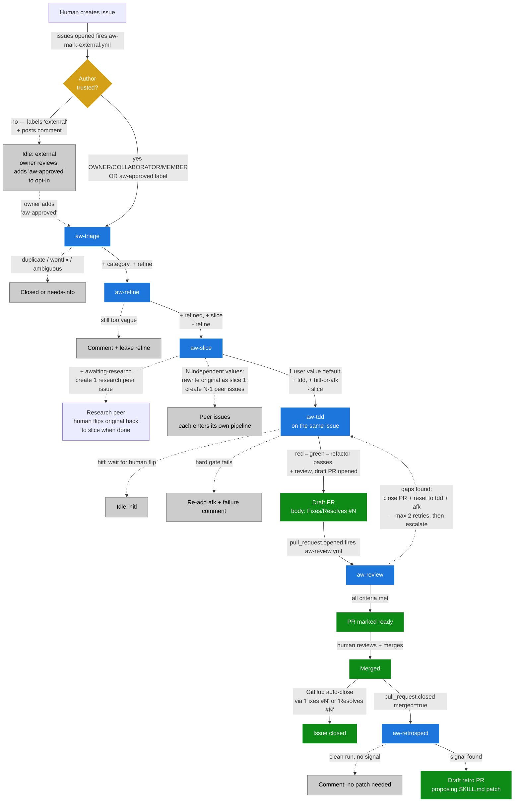
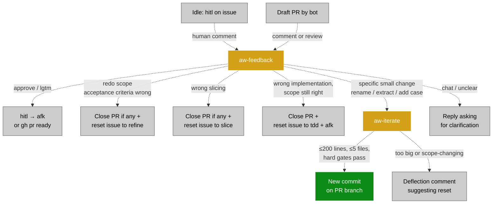
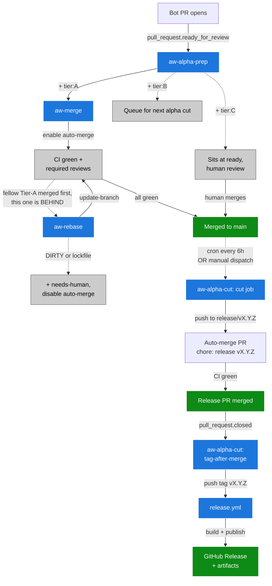

# Agentic Workflow (AW)

The AW pipeline turns a fresh GitHub issue into a reviewed pull request, autonomously, with TDD discipline and human review gates. Eight Claude Code skills, ten GitHub Actions workflows, coordinated through a label state machine. Human feedback is a first-class loop — comments on hitl-labeled issues or PRs route the agent back to any earlier stage as needed. Every bot-authored draft PR is independently reviewed by `aw-review` before being marked ready for human review.

Skill rules live in `.claude/skills/aw-<name>/SKILL.md` (the source of truth for agent behavior). Design choices and rationale in [agentic-workflow-rationale.md](agentic-workflow-rationale.md).

## Goals

- **Turn issues into PRs with discipline.** Every issue passes through triage → refine → slice → tdd. Each PR is implemented under red-green-refactor.
- **Human review at every shipping gate.** Draft PRs only, never auto-merge. Issues marked `hitl` wait for human approval before code is written. Skill patches go through draft PRs.
- **Self-improving.** On PR merge, `aw-retrospect` proposes skill patches based on what diverged. Skills get sharper over time.
- **Resilient.** Each stage is idempotent. State lives in labels — anyone can flip a label and the system recovers. Cron sweeps catch what events miss.
- **Cheap on tokens.** Bash prechecks short-circuit empty queues before invoking the LLM. The pipeline workflow runs stages back-to-back rather than separate event-triggered runs.

## Non-goals

- **Replacing human review.** Every PR opens as a draft. Every skill patch opens as a draft. Humans still merge.
- **Implementing arbitrary user requests at scale.** AW assumes one PR fits a shippable unit of user value. If too large, aw-slice splits it into peer issues — each must still ship something useful. Larger work needs human planning.
- **Cross-repo coordination.** One repo at a time today. Multi-repo features are open future work.

## Stack

| Layer | Technology | Where |
| --- | --- | --- |
| Runtime | GitHub Actions | `.github/workflows/aw-*.yml` |
| Agent | `anthropics/claude-code-action@v1` | invoked from each workflow step |
| Auth | OAuth via `CLAUDE_CODE_OAUTH_TOKEN` | uses Claude Code subscription quota |
| Skills | `.claude/skills/aw-<name>/SKILL.md` | one per pipeline stage |
| State | GitHub issue labels | label state machine |

The skill files double as the canonical contract — every workflow's prompt is just *"Run the* `aw-<name>` *skill at* `.claude/skills/aw-<name>/SKILL.md`*"* plus a few hard-constraint reminders. Substance lives in the SKILL.md files.

## Pipeline overview

The two pause points in this diagram (`Idle: hitl` and `Draft PR`) are not dead ends. Human comments at either point fire `aw-feedback`, which routes the agent back to any earlier stage based on the comment's intent. Small in-place code tweaks on the PR are handled by `aw-iterate` instead of a full re-implementation. See the feedback-loop diagram below.

**How the issue closes.** `aw-tdd` writes `Fixes #N` (bugs) or `Resolves #N` (enhancements/chores) in the PR body; GitHub auto-closes the issue on merge. Warning: `Implements #N` is **not** a recognized keyword — earlier versions used it and left issues open after merge. Other closure paths: `aw-triage` may close as `duplicate` or `wontfix`; research peers are closed by the human; peer issues from splits each close via their own PR.

### Feedback loops (aw-feedback + aw-iterate)

`aw-feedback` is the only skill that NEVER generates code. It only changes labels and PR state. Code changes (even tiny ones) go through `aw-iterate`, which checks out the existing PR branch, applies the same hard gates as `aw-tdd` (red-green-refactor where new behavior is added, full test suite, typecheck, no unrelated files), and pushes one commit. If the requested change is too big for safe in-place iteration, `aw-iterate` deflects back to `aw-feedback`'s reset paths — a small wrong commit pollutes the PR; a deflection is recoverable.

## Label scheme

Labels are the state of the system.

**Action labels** (mutually exclusive — what's needed next):

| Label | Means | Set by | Removed by |
| --- | --- | --- | --- |
| `refine` | aw-refine should pick up | aw-triage | aw-refine |
| `slice` | aw-slice should pick up | aw-refine (or human after research) | aw-slice |
| `awaiting-research` | paused on research peer | aw-slice (research path) | human |
| `awaiting-prototypes` | paused on prototype peers — user picks the winner | aw-slice (prototype-peers path) | human |
| `tdd` | aw-tdd should pick up | aw-slice | aw-tdd |
| `review` | PR is open | aw-tdd | (PR merge closes the issue) |

**State markers** (accumulate, queryable history):

| Label | Means | Set by |
| --- | --- | --- |
| `refined` | aw-refine has rewritten the body | aw-refine |

**Categories** (set by aw-triage, immutable): `bug`, `enhancement`, `chore`.

**Execution gates** (on any tdd-ready issue, mutually exclusive): `hitl`, `afk`.

**Closed states**: `wontfix`, `duplicate`.

**Escalation marker**: `needs-human` — set by `aw-review` when 2 retry cycles have already happened on an issue. Signals that `aw-tdd` has been unable to fully address the issue autonomously and a human reviewer must take over (merge as-is, land a fix on the branch, or comment new guidance and remove the label to allow another retry).

**Author-association gate**: `external` (auto-set on `issues.opened` for non-trusted authors by `aw-mark-external.yml`) blocks the AW pipeline + sweep from auto-processing the issue. `aw-approved` (set manually by the owner after review) opts an external issue into the pipeline. Trusted authors (OWNER / COLLABORATOR / MEMBER) bypass the gate entirely.

## Skills

Each skill is a markdown file with action rules. Workflows just point the agent at it. SKILL.md is the source of truth for behavior.

| Skill | Job | When | Output |
| --- | --- | --- | --- |
| `aw-triage` | Classify, dedup, close-or-categorize | issue opened, or cron | category + `refine`, OR closed as duplicate/wontfix |
| `aw-refine` | Rewrite body to outcome template (bug / enhancement / chore variants); record any assumptions made about silent / ambiguous specs | `refine` label set | `+ refined`, `+ slice` (default), OR comment-and-stop with `refine` left in place if the input is unintelligible |
| `aw-slice` | Decide one PR vs N peer issues vs research vs prototype peers; propose answers to open questions | `slice` label set | one of: `+ tdd` + `afk` (with `## Proposed answers` for any open questions; default), OR `+ tdd` + `hitl` (only when the four narrow `hitl` criteria apply), OR N peer issues + first slice = original, OR `+ awaiting-research`, OR N prototype peers + `+ awaiting-prototypes` |
| `aw-tdd` | TDD red-green-refactor + draft PR; carries assumptions / proposed answers / implementation-time decisions into the PR body's `## Decisions made` | `tdd + afk + refined + category` | `+ review`, draft PR |
| `aw-review` | Independent review of a bot-authored draft PR — checks the issue body PLUS comments after `refined` against the diff and tests; flags qualitative criteria for human visual review | `pull_request.opened` for bot-authored draft PR | per-criterion checklist comment; clean → `gh pr ready`; gaps → close PR + reset to `tdd + afk` (max 2 retries) |
| `aw-feedback` | Interpret human comment on hitl issue or bot PR; redirect pipeline accordingly | `issue_comment.created` on hitl issue, or `pull_request_review.submitted` / PR comment on bot-authored PR | label change (approve / reset to refine, slice, or tdd) OR dispatch `aw-iterate` for small code changes |
| `aw-iterate` | Push small follow-up commit on existing draft PR | `workflow_dispatch` from aw-feedback | new commit on PR branch (or deflection comment if change is too big) |
| `aw-retrospect` | Look for divergence on merged PR, propose SKILL.md patch | `pull_request.closed` + merged + claude\[bot\] | draft PR with skill edit, OR no-signal comment |
| `aw-ci-repair` | Auto-repair recurring perf-budget CI flakes on bot-authored draft PRs — wraps bare numeric literals with `PERF_BUDGET_MULTIPLIER` (Pattern A) and adds the env var to the workflow (Pattern B); posts a comment for all other failure patterns (C–E) | `workflow_run.completed` (failure on `claude/*` branch) or `workflow_dispatch` | ≤1 repair commit per PR + comment, OR comment-only for C/D/E patterns |

**The slice decision** is the most important skill rule. aw-slice asks: "what user values does this issue deliver?" Each value is a sentence "User can \[observable behaviour\]." Then:

- **0 values** → comment-and-stop (issue is internal-only).
- **1 value** (the common case) → don't slice. Mark the issue `tdd + (afk|hitl)` and pass to aw-tdd.
- **N independent values** → split into peer issues. Original becomes the first slice (rewrite body). Create N-1 new peers.

The unit is **user value**, not "issue" and not "layer." A PR that delivers half a value (settings store field with no consumer) is not a unit on its own — it ships INSIDE the PR that delivers the value it enables.

## Workflows

Fifteen workflow files. One *pipeline* + one *sweep* + four *standalones* + one *retrospect* + two *feedback loops* + one *review* + one *CI repair* + four *release infrastructure* (`aw-alpha-prep`, `aw-merge`, `aw-rebase`, `aw-alpha-cut`).

| Workflow | Triggers | Purpose |
| --- | --- | --- |
| `aw-pipeline.yml` | `issues.opened` / `issues.reopened` | Happy path: 4 jobs chained via `needs:` (triage → refine → slice → tdd). Single workflow run, stages back-to-back. The triage job carries an author-association `if:` gate so external issues don't auto-flow through the pipeline. Each job carries its own `aw-stage-{stage}-{issue}` concurrency group so it shares a queue with the sweep + standalone for the same issue+stage. |
| `aw-mark-external.yml` | `issues.opened` | Tiny no-LLM gatekeeper. Adds the `external` label + an explanatory comment to issues opened by non-trusted authors (anyone other than OWNER / COLLABORATOR / MEMBER). The pipeline + sweep prechecks then skip these issues until the owner adds `aw-approved`. |
| `aw-sweep.yml` | cron `*/15`, `workflow_dispatch`, `issues.labeled` / `issues.unlabeled` | The single cron-driven backstop AND the auto-trigger for label edits. Eight parallel jobs — four `find_<stage>` precheck pairs (just `gh + jq`, output the candidate issue number) and four `<stage>` skill jobs gated on `needs.find_<stage>.outputs.candidate != ''`. The find/skill split makes the candidate available to the skill job's `aw-stage-{stage}-{candidate}` concurrency group at job-evaluation time (#98). Idle ticks finish in \~20s with no checkouts. |
| `aw-triage.yml` | `workflow_dispatch` | Manual one-off re-triage entry point. |
| `aw-refine.yml` | `workflow_dispatch` | Manual one-off entry point. Also the dispatch target for `aw-feedback`'s "redo refined scope" action. |
| `aw-slice.yml` | `workflow_dispatch` | Manual one-off + post-research re-slice path. Also the dispatch target for `aw-feedback`'s "redo slicing" action. |
| `aw-tdd.yml` | `workflow_dispatch` | Manual one-off entry point. Also the dispatch target for `aw-feedback`'s "approve" / "redo implementation" actions. |
| `aw-review.yml` | `pull_request.opened/ready_for_review/reopened` for bot-authored draft PR, `workflow_dispatch` | Independent review on a fresh runner — separate agent session from `aw-tdd`. Reads the issue body + every comment posted after the latest `refined` marker, reads the PR diff, checks each acceptance criterion against the implementation, flags qualitative criteria for human visual review. Clean → marks PR ready. Gaps → closes PR and resets the issue to `tdd + afk` (bounded to 2 retries before escalating to human via the `needs-human` label). |
| `aw-retrospect.yml` | `pull_request.closed` | Self-improvement on merge |
| `aw-feedback.yml` | `issue_comment.created`, `pull_request_review.submitted` | Interpret human feedback on hitl issues or bot PRs; redirect pipeline by flipping labels AND explicitly dispatching the next standalone (since `GITHUB_TOKEN`-driven label changes don't fire downstream events). |
| `aw-iterate.yml` | `workflow_dispatch` (called by aw-feedback) | Push follow-up commit on a draft PR's branch when the requested change is small + specific. |
| `aw-ci-repair.yml` | `workflow_run.completed` (Tests workflow, failure), `workflow_dispatch` | Narrow CI auto-repair: detects recurring perf-budget flake patterns on bot-authored `claude/*` draft PRs and applies one-line fixes (Patterns A+B). Posts a comment for C/D/E. One-attempt cap per PR. |
| `aw-alpha-prep.yml` | `pull_request.ready_for_review`, `pull_request.opened` | Tier classifier. Labels bot PRs `tier:A` / `tier:B` / `tier:C` based on issue labels (hitl/visual), touched paths (load-bearing list), and diff size. `chore(deps):` PRs with prod_additions < 50 fast-path to Tier A. Single source of truth for the release routing decision. |
| `aw-merge.yml` | `pull_request.labeled` (filter `tier:A` + `claude/*` head ref), `workflow_dispatch` | Enables GitHub native auto-merge (squash) on Tier-A bot PRs. Merge fires when CI green + required reviews satisfied. Tier B/C are NOT touched here. |
| `aw-rebase.yml` | cron `*/15`, `workflow_dispatch` | Queue-collision recovery: when a Tier-A merge knocks other auto-merge PRs BEHIND main, this sweep calls `update-branch` (clean three-way merge). DIRTY conflicts or lockfile conflicts → disable auto-merge, add `needs-human`, post comment. |
| `aw-alpha-cut.yml` | cron `0 */6 * * *`, `workflow_dispatch`, `pull_request.closed` (head ref `release/v*`) | Two-job release cutter. `cut` (cron + dispatch): bumps `package.json`, generates `docs/history/NNN-release-vX.Y.Z-alpha.M.md`, regenerates `public/changelog-alpha.json`, pushes to `release/v${NEXT_VERSION}`, opens an auto-merge PR. `tag-after-merge` (PR closed): tags the merge commit `v${NEXT_VERSION}` and pushes the tag, which fires `release.yml`. |

Each precheck-bearing workflow finds candidates with `gh + jq` before invoking the LLM (zero token cost on empty sweeps). Cron tick is every 15 minutes.

**Token usage per workflow.** Workflows that create PRs or push to PR branches use `WORKFLOW_PAT`: `aw-tdd.yml`, `aw-iterate.yml`, `aw-retrospect.yml`, `aw-ci-repair.yml`, and the `tdd:` jobs in `aw-pipeline.yml` and `aw-sweep.yml`. Everything else (`aw-triage`, `aw-refine`, `aw-slice`, `aw-feedback`, `aw-review`, and the non-tdd jobs in pipeline/sweep) uses `GITHUB_TOKEN` so label/comment edits are suppressed by the recursion guard.

## Lifecycle (worked example, default path — owner-filed issue)

| Step | Issue state |
| --- | --- |
| Human (owner) creates issue | (no labels) |
| aw-pipeline.yml fires; aw-triage classifies | `bug + refine` |
| aw-refine rewrites body | `bug + refined + slice` |
| aw-slice: 1 user value, don't slice | `bug + refined + tdd + afk` |
| aw-tdd: red-green-refactor + draft PR | `bug + refined + review` |
| Human merges PR | issue auto-closed via `Fixes #N` (or `Resolves #N` for enhancement / chore) |
| aw-retrospect: looks for divergence | optional draft retro PR |

Total wall time: \~10–15 min from `gh issue create` to draft PR.

**External-author flow.** Issues from non-trusted authors (anyone other than OWNER / COLLABORATOR / MEMBER) get labelled `external` by `aw-mark-external.yml` and a comment is posted explaining the gate. The pipeline + sweep skip them entirely. Owner reviews each one and either closes it (spam / off-topic / malicious) or adds `aw-approved`. The next sweep tick (\~15 min) picks up `aw-approved` issues and runs the same lifecycle as above.

## Release pipeline (PR → alpha)

The release half of AW takes merged Tier-A/B PRs and turns them into a tagged alpha build. Same `aw-` namespace, same WORKFLOW_PAT, same auto-merge + branch-protection conventions as the issue half.

**Lifecycle (worked example, Tier-A PR → alpha):**

| Step | PR / repo state |
| --- | --- |
| `aw-tdd` opens draft PR | label: none |
| `aw-review` flips draft → ready | label: none |
| `aw-alpha-prep` classifies (small diff, no hitl/visual) | label: `tier:A` |
| `aw-merge` enables GitHub auto-merge | merge pending CI |
| CI green → PR merges to main | merge commit on main |
| Cron tick (every 6h): `aw-alpha-cut` cut job runs | branch `release/v0.45.0-alpha.N` + auto-merge PR opened |
| Release PR's CI passes → auto-merges | merge commit on main |
| `aw-alpha-cut` tag-after-merge fires (PR closed event) | tag `v0.45.0-alpha.N` pushed |
| `release.yml` builds + publishes | GitHub Release with artifacts |

Total wall time: \~25–35 min from bot-PR merge to published alpha (build dominates).

**Tier B PRs** skip `aw-merge` and queue for the next 6h alpha-cut tick, which still picks them up via the `label:tier:A,tier:B` enumeration. **Tier C PRs** sit at ready until a human merges them; the alpha-cut still fires (Tier C is the *stable*-promotion gate, not the alpha gate).

## Failure modes

**Auth failure (OAuth token invalid):** action fails with `401 Invalid bearer token`. Regenerate via `claude setup-token` + `gh secret set CLAUDE_CODE_OAUTH_TOKEN`.

**Hard gate failure in aw-tdd:** any of red-not-red / `pnpm test` / typecheck / lint / unrelated-files-modified → revert local changes, re-add `afk`, post failure comment. Human investigates.

**Pipeline + standalone race (resolved by GITHUB_TOKEN):** historically, when the pipeline's bot added a label the same event fired the standalone workflow, producing a skipped tile per label change. Resolved by switching the agent's `gh` calls to `GITHUB_TOKEN`. The standalones (`aw-triage`, `aw-refine`, `aw-slice`, `aw-tdd`) are now `workflow_dispatch`-only — they no longer carry an `issues.labeled` trigger; the sweep workflow's `issues: [labeled, unlabeled]` trigger handles label-edit auto-pickup with prechecks instead.

**Bot-chain blocked:** by default, `claude-code-action` refuses bot-initiated runs. Each downstream workflow has `allowed_bots: "github-actions[bot]"` to permit chained triggers (legacy `claude[bot]` value updated as part of the GITHUB_TOKEN switch).

**Bot PRs without CI checks:** before #118, bot-authored PRs created via `gh pr create` with `GITHUB_TOKEN` did not fire `pull_request` events (the recursion guard suppresses them). `test.yml` therefore never ran on bot PRs. Fixed by routing PR creation through `WORKFLOW_PAT`.

**External issues riding the pipeline:** by default the pipeline auto-processed every newly-opened issue regardless of author. Mitigated by an author-association gate that labels external issues `external` and requires owner-applied `aw-approved` to release them.

## Design choices and rationale

The full history of architectural pivots and the reasoning behind each decision lives in [agentic-workflow-rationale.md](agentic-workflow-rationale.md). Read it when adding a new skill, debugging an unusual workflow behavior, or questioning why the system is shaped the way it is.

## Working with the system

**Adding a skill:** create `.claude/skills/aw-<name>/SKILL.md`. Add the skill's stage to `aw-sweep.yml` as a `find_<name>` + `<name>` job pair (find runs the gh + jq precheck and outputs the candidate; skill job gates on `needs.find_<name>.outputs.candidate != ''` and uses `aw-stage-<name>-${{ needs.find_<name>.outputs.candidate || github.run_id }}` as its concurrency group — see rationale doc for the shared concurrency group choice). Create `.github/workflows/aw-<name>.yml` for `workflow_dispatch` only (mirror an existing standalone — workflow-level concurrency `aw-stage-<name>-${{ ... }}`, precheck + claude-code-action with the right `github_token` — `WORKFLOW_PAT` if it creates PRs or pushes to PR branches, `GITHUB_TOKEN` otherwise). If the skill ever runs against external-author candidates via the sweep, extend each new `find_<name>` precheck JQ with the `external`/`aw-approved` filter. Add the new action label(s). Wire into `aw-pipeline.yml`'s `needs:` chain if it belongs to the happy path. If the skill is reachable from `aw-feedback`, add the matching `gh workflow run aw-<name>.yml --field issue_number=N` to the relevant action block in `aw-feedback`'s SKILL.md. Update this doc.

**Renaming a label:** `gh label edit <old> --name <new>`. Updates all existing issues automatically. Then update SKILL.md, workflow YAML references, and the regression-lock tests in `src/lib/__tests__/aw-*.test.ts`.

**Approving an external issue:** review the body, then `gh issue edit <N> --add-label aw-approved`. Next sweep tick (\~15 min) picks it up. Or close the issue if it's spam / off-topic / malicious.

**Monitoring:** `gh workflow list`, `gh run list --workflow aw-pipeline.yml`, `gh issue list --label tdd --label afk`, `gh issue list --label external` (queue of external issues awaiting review), `gh pr list --draft`.

**One-time setup:**

- **OAuth (Claude subscription):** `claude setup-token`, then `gh secret set CLAUDE_CODE_OAUTH_TOKEN`. Powers the LLM call in every skill.
- **WORKFLOW_PAT (bot-PR CI gating):** GitHub UI → Settings → Developer settings → Personal access tokens → Fine-grained tokens. Scope to this repo; permissions: Contents R&W, Pull requests R&W, Workflows R&W, Issues R&W, Actions Read, Metadata Read. Save as repo secret `WORKFLOW_PAT`. 90-day expiry — calendar a rotation reminder. See *Choice: WORKFLOW_PAT for bot-PR CI gating*.
- **Labels:** `external` (gray) and `aw-approved` (green) — created automatically the first time they're applied, but worth setting colors/descriptions via `gh label create` for queue clarity.

## Open questions

- **Multi-repo support.** Today AW runs in one repo at a time. Cross-repo features (shared skills via submodule, propagated retros, shared label schema) are open work.
- **Better retrospect signals.** Current heuristics are basic. Possible improvements: diff parsing for anti-patterns, time-to-merge correlation, aggregate "retro across last 10 merges."
- **Cost monitoring.** No visibility into subscription quota consumption today. Daily token usage by skill, per-skill ceilings, alerts before cap.
- **Skill versioning.** SKILL.md files are version-controlled but no formal versioning scheme. A frontmatter `version:` field would help retros track behavior changes over time.

## Glossary

- **AW** — Agentic Workflow. The pipeline described in this doc.
- **Action label** — mutually-exclusive label that says "what's needed next" (`refine`, `slice`, `tdd`, etc.).
- **State marker** — label that accumulates as the pipeline progresses (`refined`).
- **Peer issue** — an issue created by aw-slice's split, sibling to the original. No parent/child link.
- **Research peer** — a peer issue with title `Research: <question>` created when aw-slice can't slice confidently.
- **HITL** — human in the loop. `hitl`-labeled issue waits for human approval before aw-tdd runs.
- **AFK** — agent-OK-to-run-autonomously. `afk`-labeled issue is picked up by aw-tdd without approval.
- **Hard gate** — a check in aw-tdd that aborts the run on failure (red-not-red, tests fail, typecheck fail, unrelated files modified).
- **Pipeline workflow** — `aw-pipeline.yml`. Runs the full happy path (triage → refine → slice → tdd) as sequential jobs on issue creation.
- **Standalone workflow** — `aw-triage.yml`, `aw-refine.yml`, `aw-slice.yml`, `aw-tdd.yml`. `workflow_dispatch`-only entry points used by `aw-feedback` to redirect the pipeline after a label flip. Auto-pickup happens in the sweep, not here.
- **Sweep workflow** — `aw-sweep.yml`. Single cron-driven backstop and label-edit auto-trigger. Idle ticks finish in \~20s with no checkouts.
- **Gatekeeper workflow** — `aw-mark-external.yml`. Tiny no-LLM workflow that fires on `issues.opened` for non-trusted authors and labels them `external` + posts an explanatory comment.
- **Review workflow** — `aw-review.yml`. Independent review of a bot-authored draft PR on a fresh runner. Read-only on code; only modifies labels, PR state, and posts comments. Bounded to 2 reset cycles before escalating via the `needs-human` label.
- **needs-human** — escalation label set by `aw-review` when 2 retry cycles have already happened on an issue.
- **external** — label auto-applied by `aw-mark-external.yml` to issues from non-trusted authors. Pipeline + sweep prechecks skip these unless `aw-approved` is also present.
- **aw-approved** — label manually applied by the owner to opt an external issue into the pipeline. Pipeline + sweep accept it as if the author were trusted.
- **WORKFLOW_PAT** — fine-grained Personal Access Token stored as a repo secret. Used by PR-creating workflows (aw-tdd / aw-iterate / aw-retrospect / pipeline-tdd / sweep-tdd) so the resulting PR fires `pull_request` events normally and CI runs. Other workflows keep `GITHUB_TOKEN` for recursion-guard suppression.
- **Retro PR** — draft PR opened by aw-retrospect proposing a SKILL.md patch.