# Mermaid Diagram Examples

Examples of inline Mermaid diagrams using fenced code blocks. Type `/mermaid` in the editor or write a ```` ```mermaid ```` code block directly. The editor renders a live SVG preview — double-click to edit the source.

---

## 1. Simple Flowchart

A basic top-down decision flow.

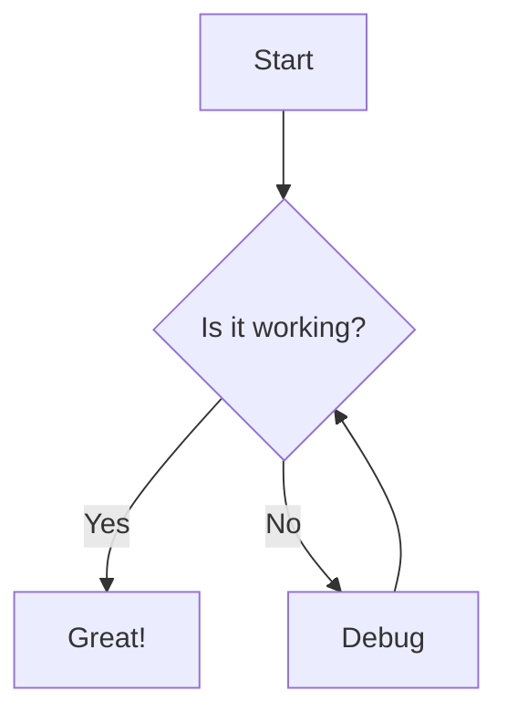

---

## 2. Left-to-Right Flowchart

Horizontal layout with subprocesses.

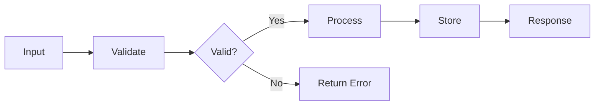

---

## 3. Sequence Diagram

API request flow between client and server.

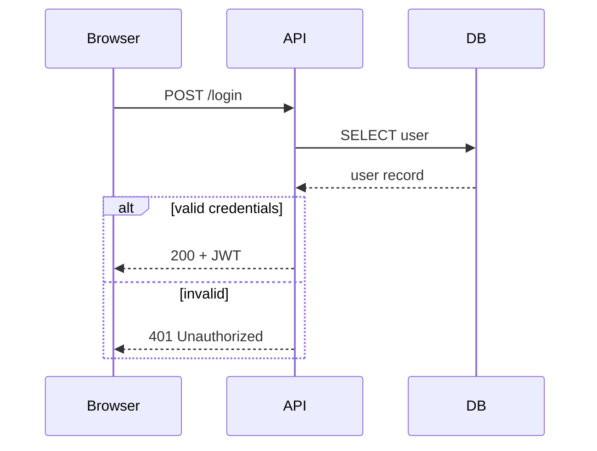

---

## 4. Class Diagram

Object-oriented design with relationships.

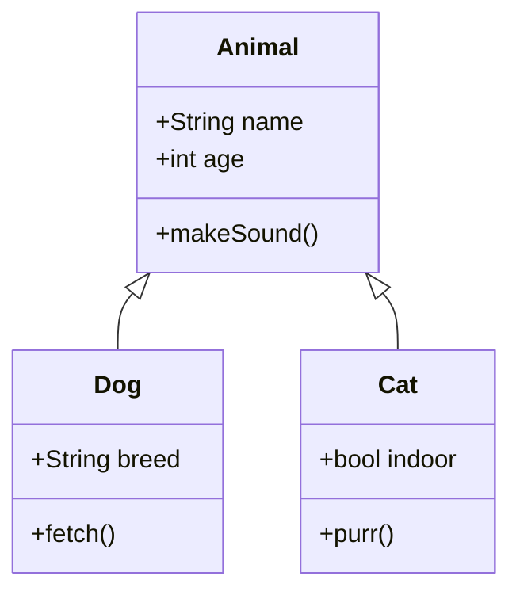

---

## 5. State Diagram

Document lifecycle states and transitions.

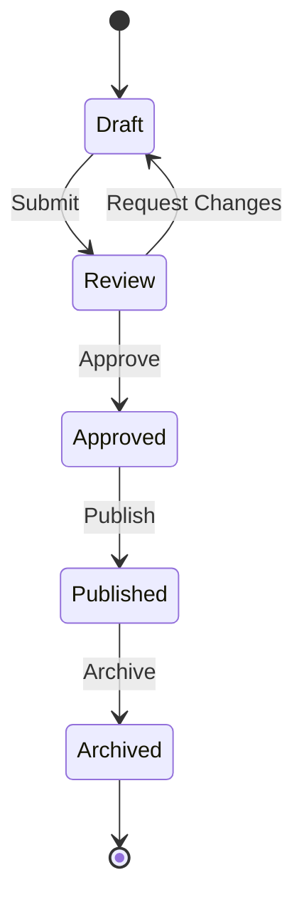

---

## 6. Entity-Relationship Diagram

Database schema for a blog.

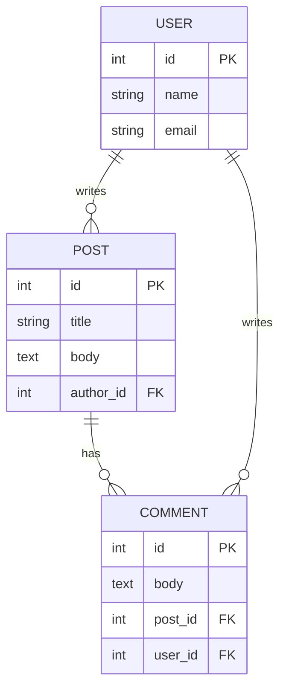

---

## 7. Gantt Chart

Project timeline with milestones.

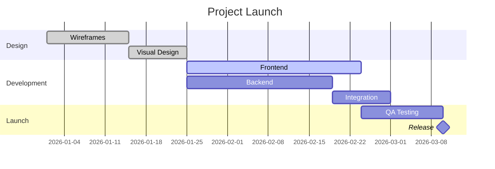

---

## 8. Pie Chart

Survey results breakdown.

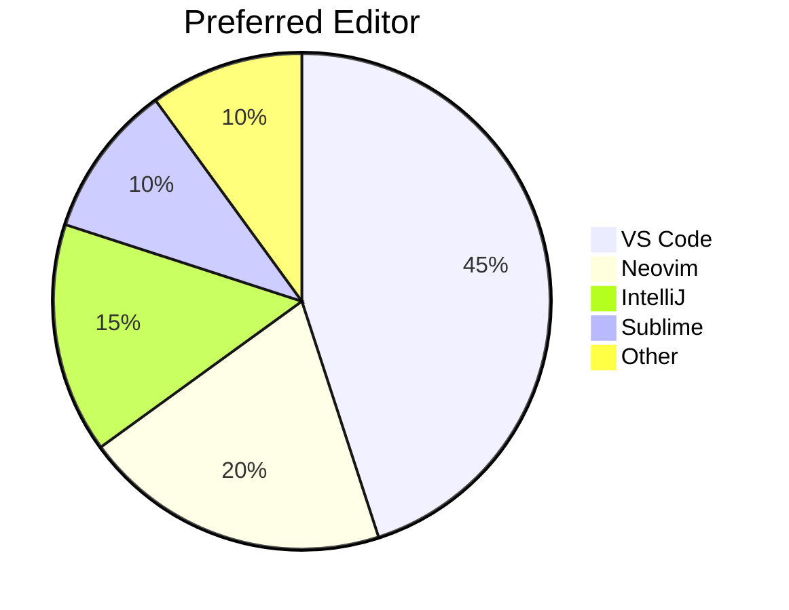

---

## 9. Git Graph

Branch and merge workflow.

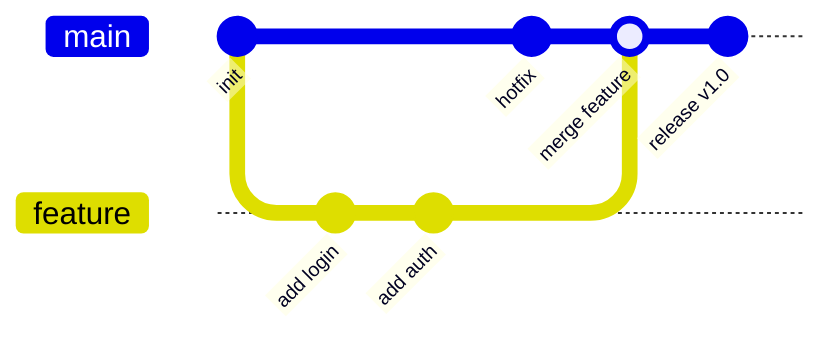

---

## 10. Mindmap

Brainstorming a product feature.

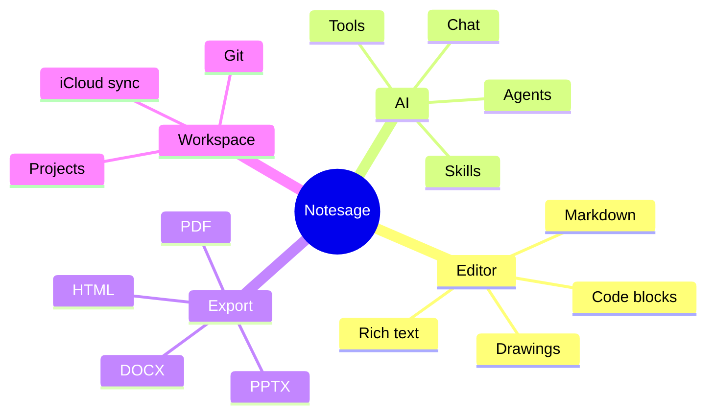

---

## 11. User Journey

Onboarding experience mapping.

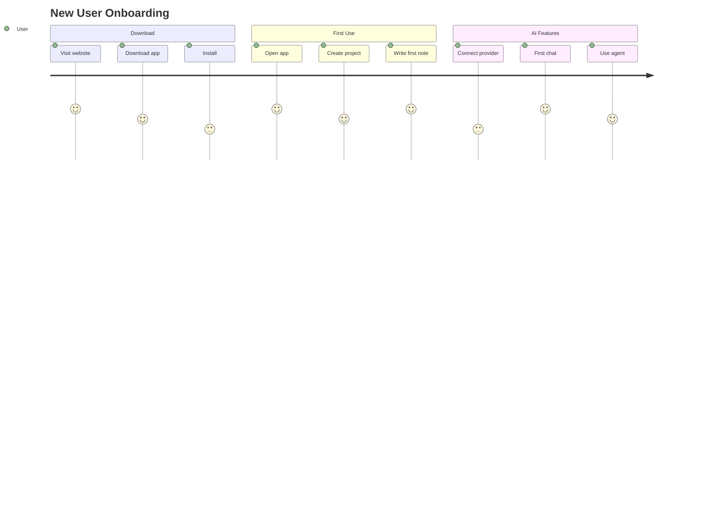

---

## 12. Timeline

Product version history.

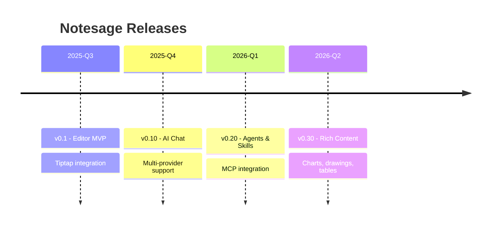

---

## 13. Flowchart with Subgraphs

Grouped nodes for visual organization.

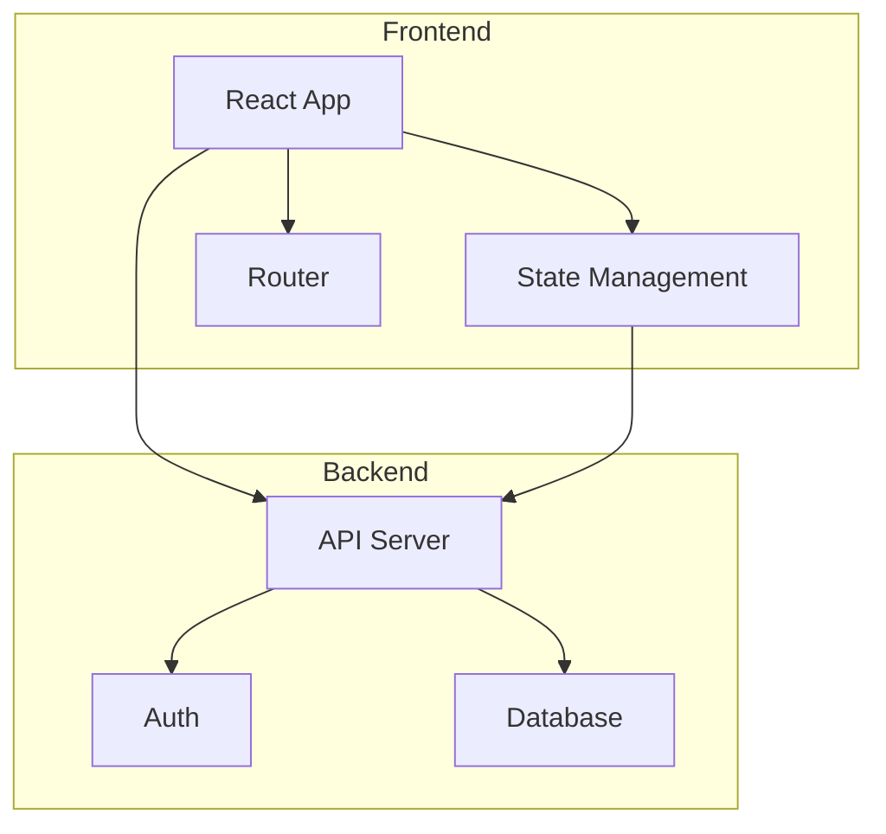

---

## 14. Sequence Diagram with Notes and Loops

Advanced sequence features: notes, loops, and parallel blocks.

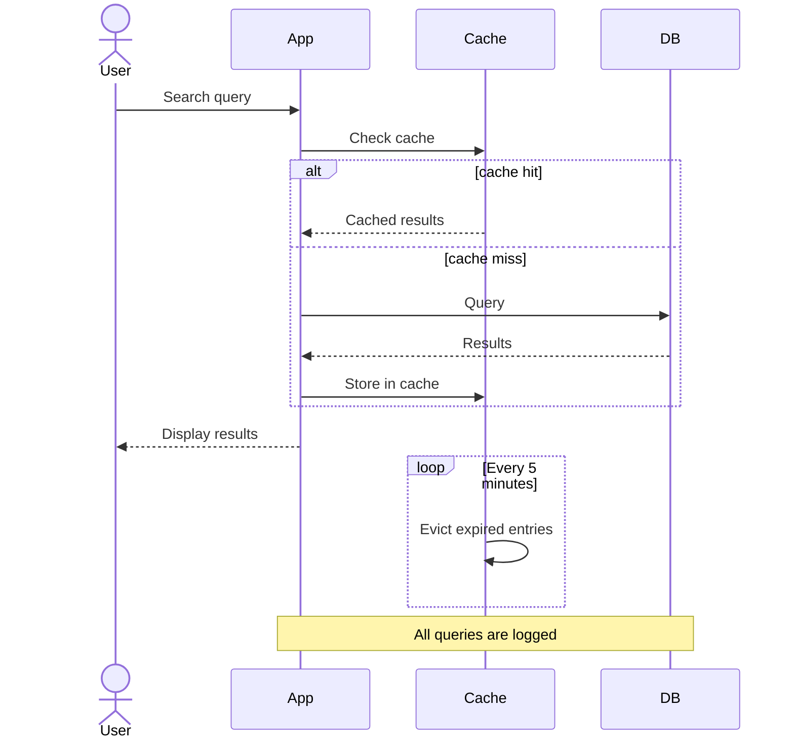

---

## 15. Flowchart with Special Characters

Testing labels with quotes, parentheses, and symbols.

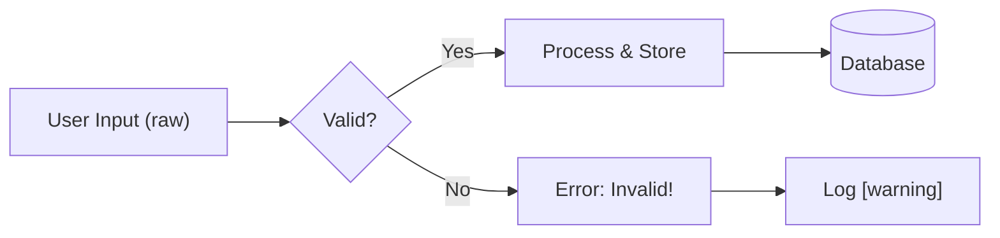

---

## Tips

- **Theme:** Diagrams automatically match light/dark mode
- **Edit:** Double-click the rendered diagram to edit the source
- **Convert:** Click the pencil icon to convert flowcharts into editable Excalidraw drawings
- **AI:** Ask the AI chat to generate mermaid diagrams — all models support the syntax
- **Docs:** Full syntax reference at [mermaid.js.org](https://mermaid.js.org)